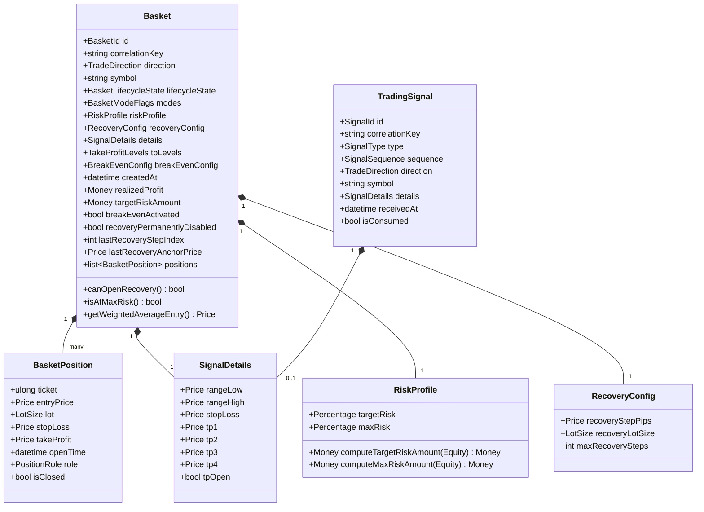
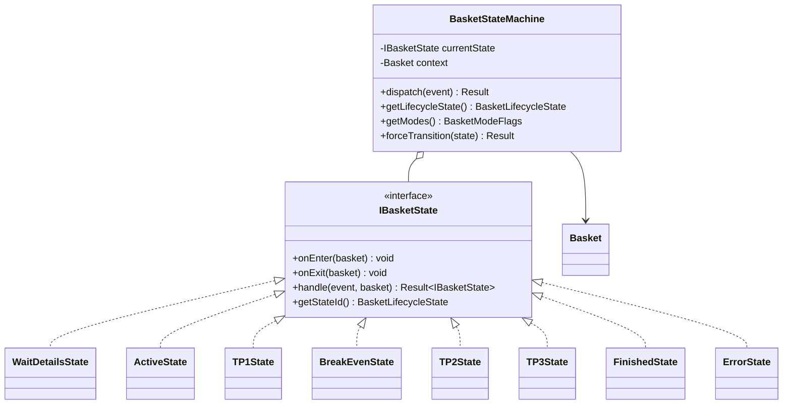
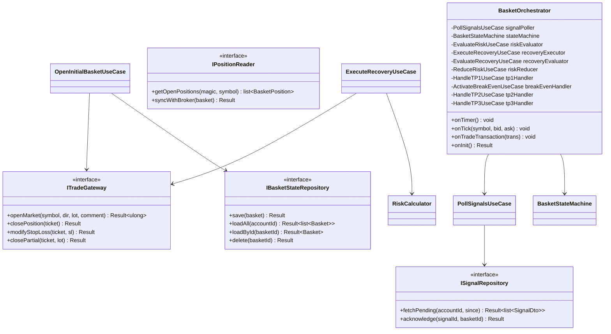
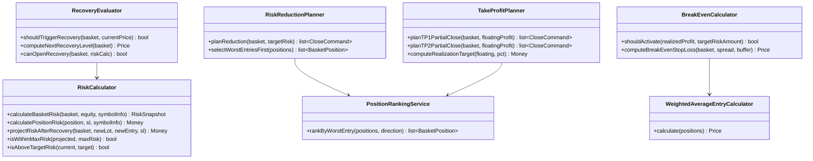
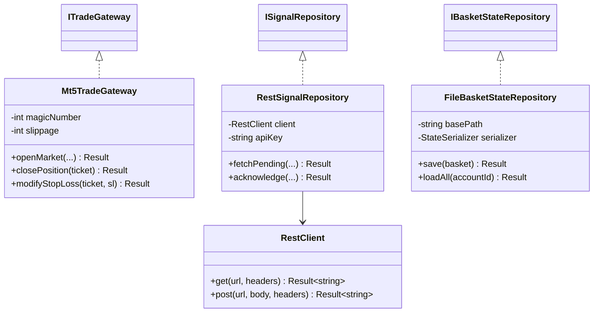
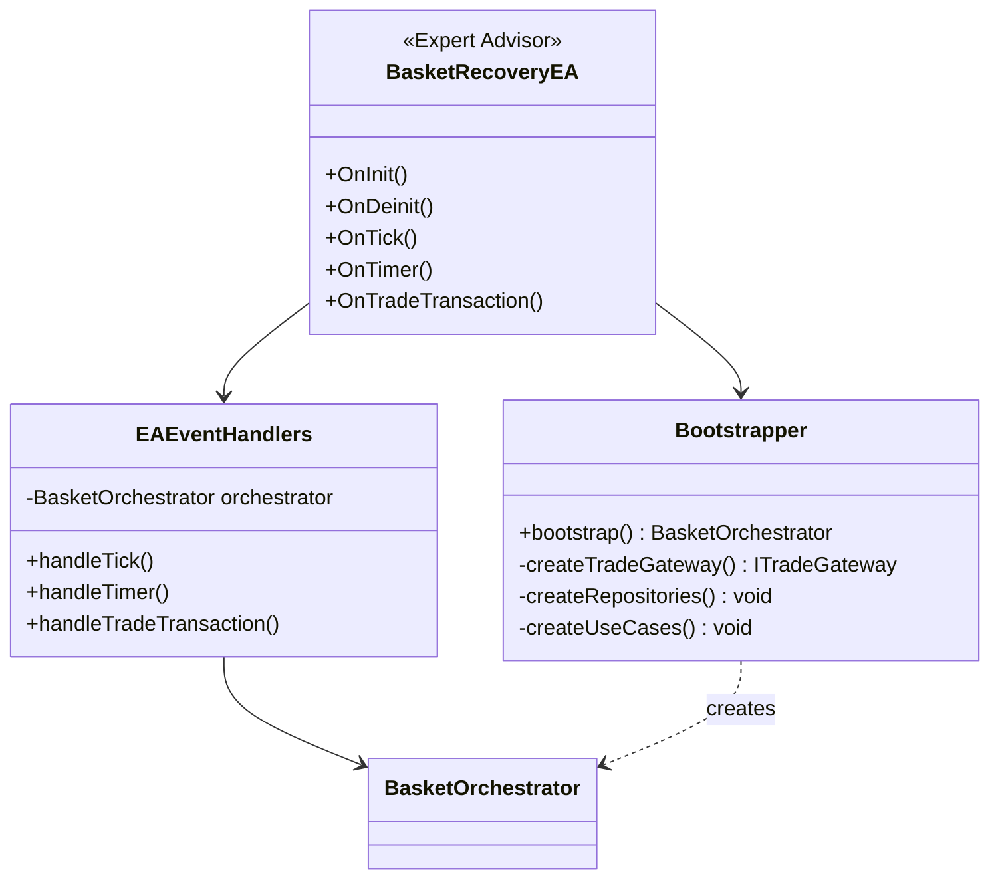
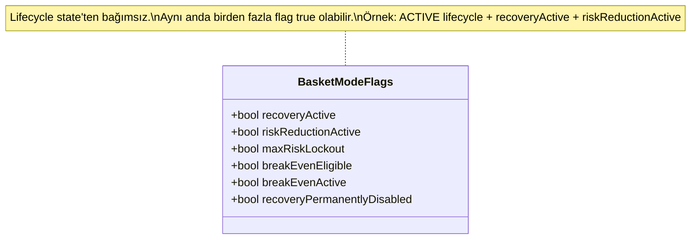
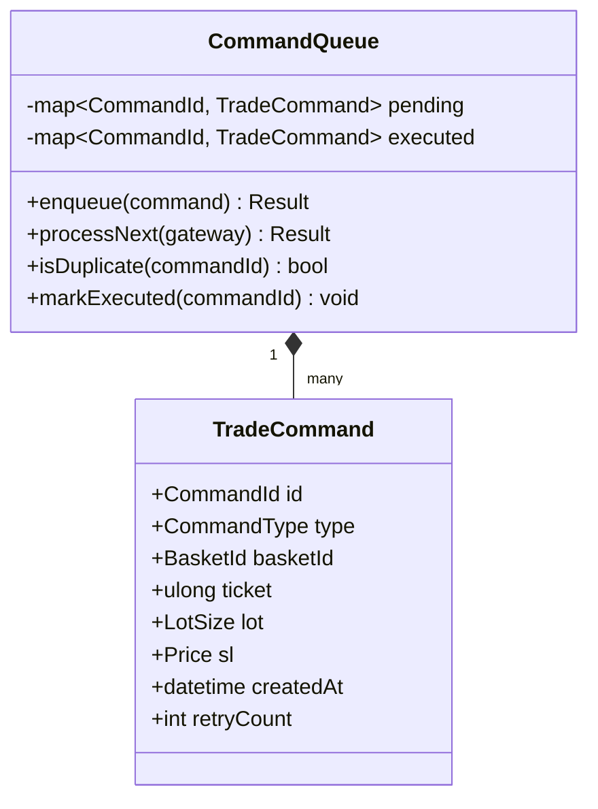

# 3. Sınıf Diyagramları

## 3.1 Domain — Core Entities

## 3.2 State Machine

## 3.3 Application Layer — Use Cases & Ports

## 3.4 Domain Services

## 3.5 Infrastructure Adapters

## 3.6 Composition Root

## 3.7 BasketModeFlags (Orthogonal Regions)

## 3.8 Command Queue (Idempotency)

