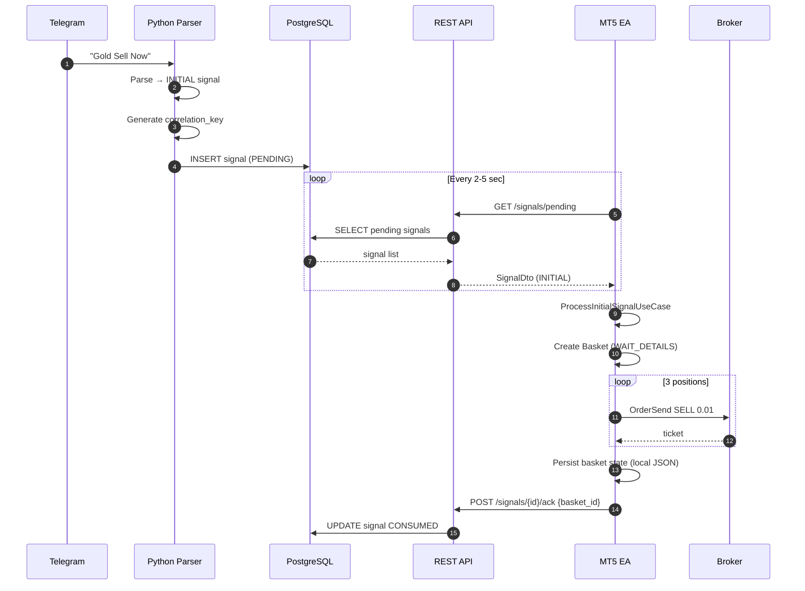
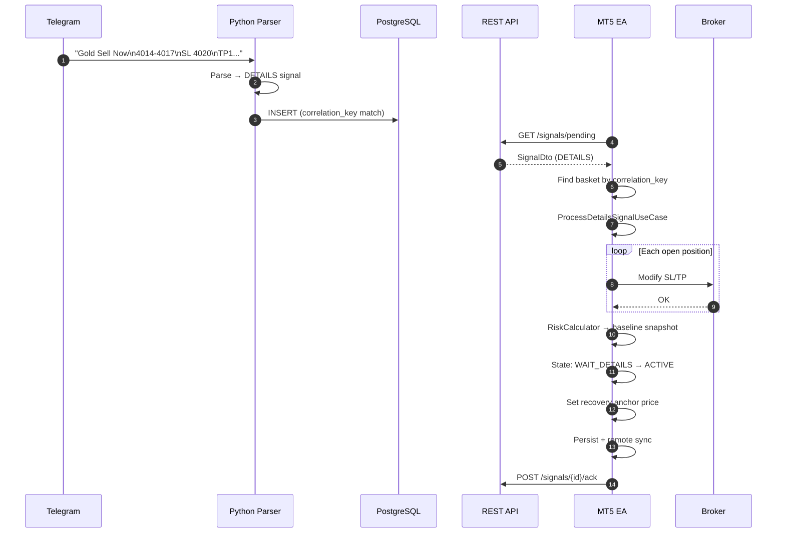
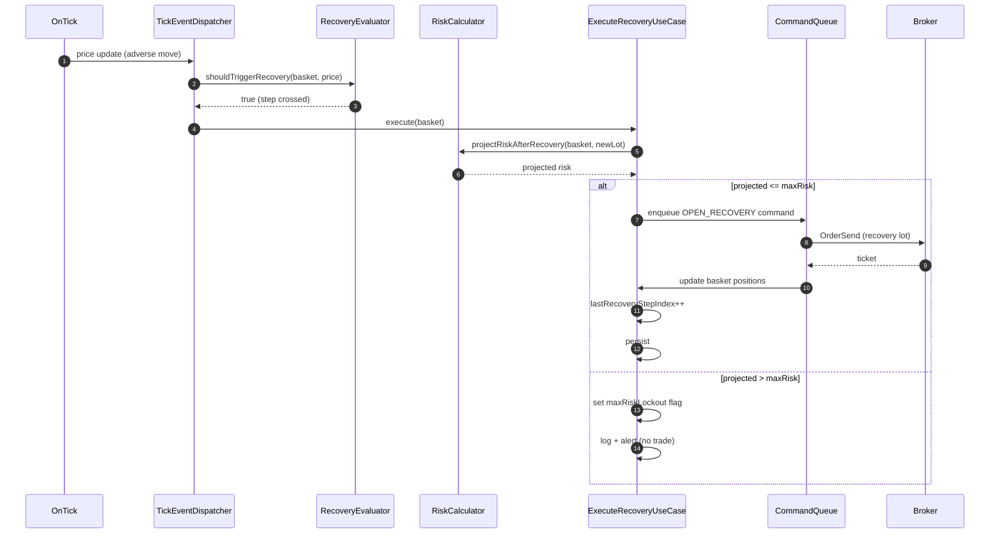
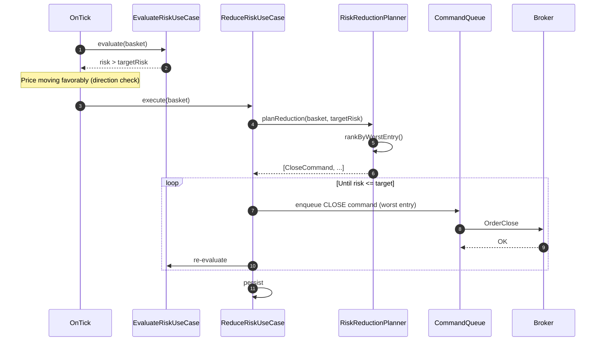
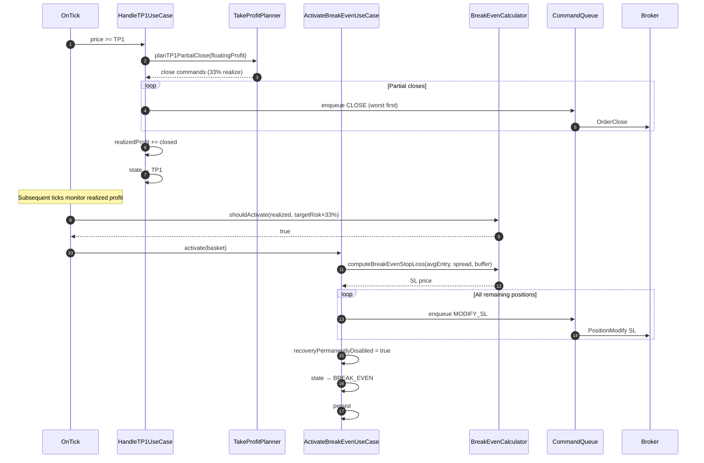
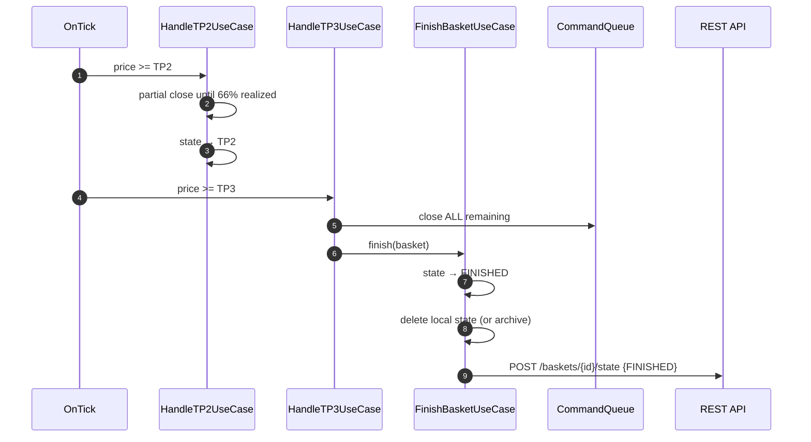
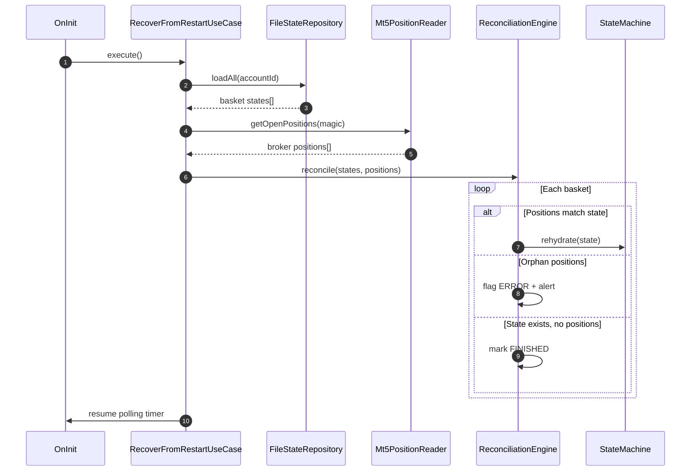
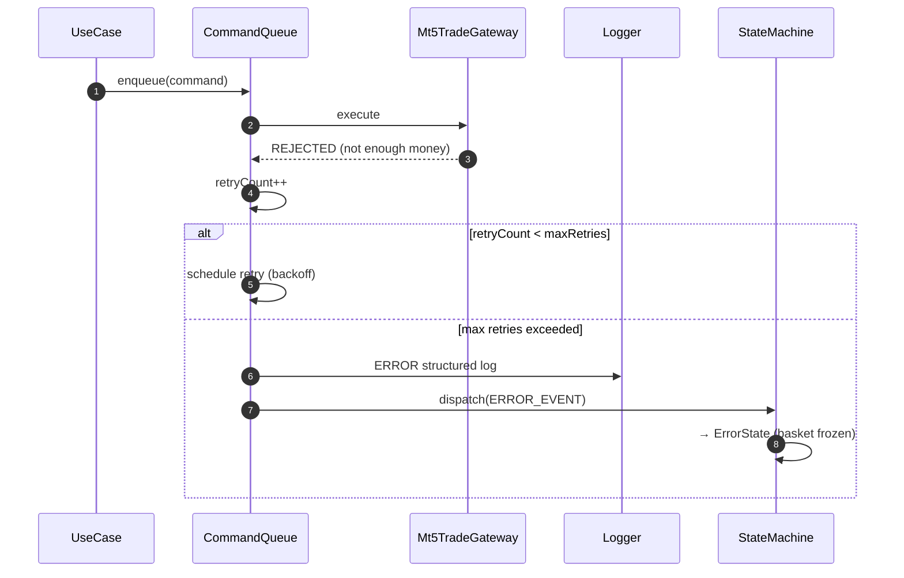

# 6. Sequence Diyagramları

## 6.1 Signal #1 — İlk Sepet Oluşturma

## 6.2 Signal #2 — Detay Güncelleme ve Aktivasyon

## 6.3 Recovery Pozisyon Açma

## 6.4 Risk Reduction

## 6.5 TP1 + Break-Even Akışı

## 6.6 TP2 → TP3 → Basket Finish

## 6.7 MT5 Restart Recovery

## 6.8 Hata Senaryosu — Broker Emir Reddi

