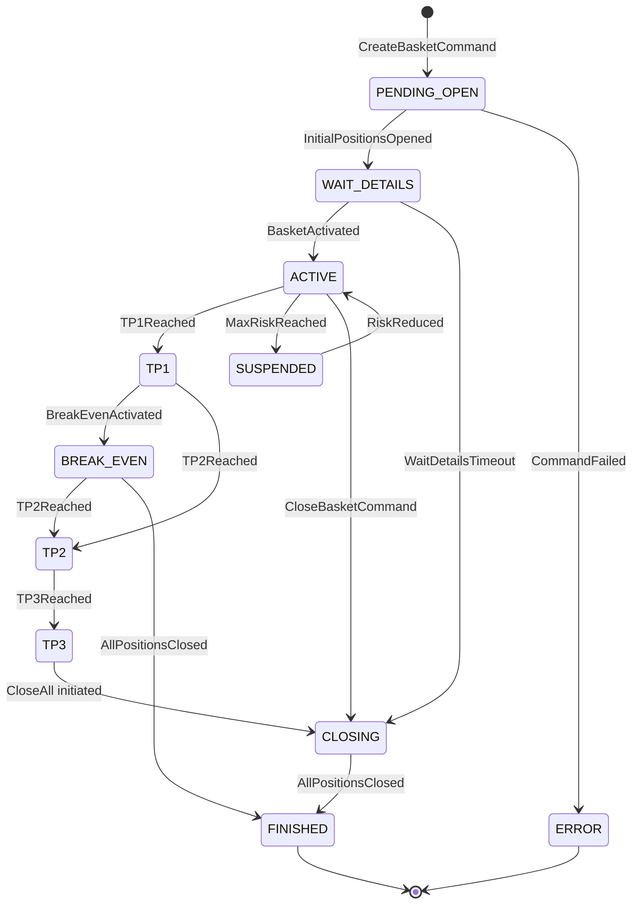

# 7. Durum Makinesi (State Machine)

> **Revizyon v2:** Geçişler artık state class'larında değil; **TransitionRuleRegistry** tablosunda tanımlı. Bkz. [20-transition-rules.md](./20-transition-rules.md).

## 7.1 Tasarım Prensibi

İki boyutlu model korunur:

```
BOYUT 1: Lifecycle State → TransitionRuleRegistry (explicit rules)
BOYUT 2: Mode Flags       → ModeTransitionRuleRegistry (parallel)
```

State sınıfları (varsa) yalnızca **entry/exit actions** tutar — geçiş kararı `TransitionEngine`'de.

---

## 7.2 Lifecycle States

| State | Açıklama |
|-------|----------|
| `PENDING_OPEN` | CreateBasketCommand işleniyor |
| `WAIT_DETAILS` | 3 pozisyon açık, SL/TP yok |
| `ACTIVE` | Tam operasyonel |
| `TP1` | TP1 partial close tamamlandı |
| `BREAK_EVEN` | SL avg entry'de, recovery kapalı |
| `TP2` | TP2 partial close tamamlandı |
| `TP3` | Final close tetiklendi |
| `CLOSING` | Toplu kapatma devam ediyor |
| `SUSPENDED` | Max risk lockout |
| `FINISHED` | Terminal — tüm event'ler rejected |
| `ERROR` | Terminal — manual intervention |

---

## 7.3 Transition Engine Entegrasyonu

```
Command Handler completes
    → EventBus.publish(BasketActivated)
    
TransitionEventHandler subscribes BasketActivated:
    → TransitionEngine.apply(basket, event)
    → IF applied: StateTransitioned event
    → IF rejected: TransitionRejected event
```

**Doğrudan state mutation yasak** — yalnızca TransitionEngine.

---

## 7.4 Lifecycle Diyagram (unchanged semantics)



---

## 7.5 Domain Events → Transitions

| Domain Event | Typical Transition | Doc Reference |
|--------------|-------------------|---------------|
| `InitialPositionsOpened` | → WAIT_DETAILS | 20 § PENDING_OPEN |
| `BasketActivated` | → ACTIVE | 20 § WAIT_DETAILS |
| `TP1Reached` | → TP1 | 20 § ACTIVE |
| `BreakEvenActivated` | → BREAK_EVEN | 20 § TP1 |
| `TP2Reached` | → TP2 | 20 § TP1/BE |
| `TP3Reached` | → TP3 | 20 § TP2 |
| `AllPositionsClosed` | → FINISHED | 20 § CLOSING |
| `MaxRiskReached` | → SUSPENDED | 20 § ACTIVE |

---

## 7.6 Rejected Events

Her state için explicit rejected event listesi doc 20'de. Örnek:

**WAIT_DETAILS rejects:** `RecoveryStepCrossed`, `TP1Reached`, `TargetRiskReached`, `BreakEvenEligible`

Rejected → `TransitionRejected` event + DEBUG log; state değişmez.

---

## 7.7 Mode Flags (Orthogonal — unchanged)

Mode transitions lifecycle'a dokunmaz; ayrı rule registry:

- `recoveryActive`, `riskReductionActive`, `maxRiskLockout`, `recoveryPermanentlyDisabled`

Mode handler'lar event bus subscriber — TransitionEngine'den bağımsız.

---

## 7.8 State Persistence

State değişimi `StateTransitioned` event'i ile PersistenceHandler tarafından persist edilir:

```json
{
  "lifecycle_state": "ACTIVE",
  "state_entered_at": "...",
  "last_transition": {
    "from": "WAIT_DETAILS",
    "to": "ACTIVE",
    "event": "BasketActivated",
    "rule_id": "WAIT_DETAILS__BasketActivated__ACTIVE"
  }
}
```

---

## 7.9 Startup Validation

Bootstrapper `TransitionRuleRegistry.validate()` çalıştırır — fail ise INIT_FAILED. Bkz. doc 20 § 20.8.

---

## 7.10 WAIT_DETAILS Timeout

Profile-driven: `wait_details_timeout_minutes`, `wait_details_emergency_action`.  
Timeout event → `WaitDetailsTimeout` → CLOSING (TransitionEngine).

Tam rule: doc 20.
