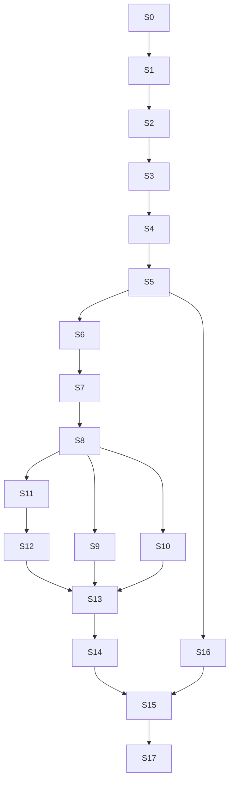

# 17. Implementasyon Yol Haritası (Sprint Planı)

> **Revizyon v2:** Command Queue, Event Bus, Transition Rules, Trade Executor, Position Snapshot, Config Profiles, Backtesting Adapter sprint'lere entegre edildi.

## 17.1 Sprint Prensipleri

1. Her sprint sonunda EA **derlenebilir**
2. **Domain-first** + **port-first** (IExecutionEnvironment erken tanımlanır)
3. Feature flags ile incremental enable
4. v2 pattern'ler S1-S5 foundation'da kurulur — sonradan retrofit yok
5. Backtest stub Sprint 4'ten itibaren mevcut

---

## 17.2 Sprint Overview (v2)

| Sprint | Ad | Derlenebilir Çıktı |
|--------|-----|-------------------|
| S0 | Proje İskeleti | Empty EA compiles |
| **S0.1** | **Audit Düzeltmeleri** | **Katman ihlalleri giderildi; normalize DTO, immutable profile, dar ApplicationContext** |
| **S1** | **Transition Engine + Command Processor** | **Kernel derlenir; 4 test scripti; broker/trading yok** |
| **S2** | **Basket Aggregate + Domain Handlers** | **Aggregate tek kaynak; 5 command + 4 event handler; repository** |
| S3 | Processor Integration + Persistence | Handler wiring + file persistence |
| S3 | Command Queue + Event Bus | Enqueue/dispatch/publish test |
| S4 | Trade Executor + Snapshot | Simulated open/close + snapshot |
| S5 | IExecutionEnvironment + REST ingest | Command from mock API |
| S6 | CreateBasketCommand | 3 positions via request queue |
| S7 | ActivateBasketCommand | SL/TP, ACTIVE transition |
| S8 | Risk Engine (snapshot) | Risk events on snapshot update |
| S9 | Recovery Engine | Recovery via command + events |
| S10 | Risk Reduction | TargetRiskReached → close commands |
| S11 | TP1 Engine | TP1Reached → partial close |
| S12 | Break-Even Engine | BE transition + SL sync guard |
| S13 | TP2 & TP3 + Finish | Full lifecycle |
| S14 | Restart Recovery | Command + snapshot + request replay |
| S15 | Production Hardening | IdempotencyStore, dead letter, checklist |
| S16 | Python Command API | `/commands/pending` end-to-end |
| S17 | Backtest Runner | Historical replay report |

---

## 17.2.1 Sprint 0.1 — Audit Düzeltmeleri (Tamamlandı)

Bkz. [26-sprint-0.1-audit-fixes.md](./26-sprint-0.1-audit-fixes.md).

```
Deliverables:
  ├── Application→Interfaces bağımlılığı kaldırıldı (CEAConfiguration → Application)
  ├── CNormalizedTradeTransaction + Mt5TradeTransactionNormalizer
  ├── CProfileSnapshot (immutable) + CBasket.BindProfileSnapshot
  ├── CBasketVersion alanları
  ├── ApplicationContext dar API (service locator anti-pattern giderildi)
  ├── ILogBuffer + IAsyncLogWriter port tanımları
  ├── CBrokerReconciliationService (startup broker scan)
  └── CResult<T>.TryGetValue — güvensiz Value() kaldırıldı
```

**Sprint 1 başlatılmaz** — yalnızca audit maddeleri uygulandı.

---

### Sprint 1 — Shared Types + Configuration Profiles

```
Deliverables:
  ├── Result.mqh, Money.mqh, Price.mqh, Identifiers.mqh
  ├── IConfigurationProfileLoader + ProfileBundle
  ├── profiles/default/*.profile.json (risk, recovery, tp, be, execution)
  ├── Profile validation on startup
  └── FileLogger
```

### Sprint 2 — Domain + Transition Rules

```
Deliverables:
  ├── Basket, PositionSnapshot, ProfileSnapshot entities
  ├── TransitionRuleRegistry (full table — doc 20)
  ├── TransitionEngine
  ├── ModeTransitionRuleRegistry
  └── TestTransitionRules.mq5 — 100% rule coverage target
```

### Sprint 3 — Command Queue + Event Bus

```
Deliverables:
  ├── ICommandQueue + FileCommandPersistence
  ├── IEventBus + InMemoryEventBus
  ├── CommandProcessor (two-phase loop)
  ├── ICommandHandlerRegistry + stub handlers
  ├── IdempotencyKey generation
  └── TestCommandEventPipeline.mq5
```

### Sprint 4 — Trade Executor + Position Snapshot

```
Deliverables:
  ├── ITradeRequestQueue + TradeRequest types
  ├── Mt5TradeExecutor (ONLY OrderSend/Modify/Close)
  ├── SimulatedTradeExecutor (stub)
  ├── IPositionSnapshotStore + InMemorySnapshotStore
  ├── TradeTransactionNormalizer
  └── Test: request → executor → snapshot → event
```

### Sprint 5 — IExecutionEnvironment + REST Ingest

```
Deliverables:
  ├── IExecutionEnvironment + LiveExecutionEnvironment
  ├── RestCommandSourceAdapter (fetch → enqueue)
  ├── Separate slow/fast timers
  ├── Bootstrapper full wiring
  └── Mock API integration test
```

### Sprint 6-7 — CreateBasket + ActivateBasket Commands

```
S6: CreateBasketCommandHandler
    → TradeRequest[] (3× open)
    → events: BasketCreated, InitialPositionsOpened
    → transition: PENDING_OPEN → WAIT_DETAILS

S7: ActivateBasketCommandHandler (+ UpdateSL/TP if split)
    → TradeRequest[] (modify SL/TP)
    → events: BasketActivated
    → transition: WAIT_DETAILS → ACTIVE
```

### Sprint 8-13 — Engine Event Handlers (NOT direct use cases)

```
Pattern:
  PriceThresholdMonitor publishes TP1Reached
  → TP1Handler subscribes → enqueues ExecuteTPPartialCloseCommand
  → CommandHandler → TradeRequest[] → Executor
  → PositionClosed events → RiskEvaluationHandler
```

### Sprint 14 — Restart Recovery

```
Deliverables:
  ├── Replay pending commands + trade requests
  ├── RestartReconciliationService (one-time broker scan)
  ├── Snapshot rebuild from broker
  └── MigrationRunner (schema_version)
```

### Sprint 15 — Production Hardening

```
Deliverables:
  ├── IdempotencyStore
  ├── Dead letter queue + operator commands (Requeue/Abandon)
  ├── doc 25 production checklist — all P0 items
  ├── TradeExecutor grep CI rule
  └── Chaos tests
```

### Sprint 17 — Backtest Runner

```
Deliverables:
  ├── BacktestExecutionEnvironment
  ├── HistoricalCommandSource + HistoricalBarFeed
  ├── BacktestRunner.mq5 script
  └── Sample replay + BacktestReport
```

---

## 17.4 Sprint Dependency Graph (v2)



---

## 17.5 Milestone Checkpoints (v2)

| Milestone | Sprint | Kriter |
|-----------|--------|--------|
| **M1: v2 Foundation** | S5 | Command+Event+Executor+Snapshot pipeline works |
| **M2: Signal Flow** | S7 | Create+Activate commands end-to-end |
| **M3: Engines** | S10 | Recovery + risk reduction via events |
| **M4: Full Lifecycle** | S13 | TP1→BE→TP2→TP3 complete |
| **M5: Production** | S15 | doc 25 checklist green |
| **M6: Integrated** | S16 | Python commands → MT5 |
| **M7: Backtest** | S17 | Replay matches live sample |

---

## 17.6 Tahmini LOC (v2)

| Modül | LOC |
|-------|-----|
| Command Queue + Handlers | ~2,500 |
| Event Bus + Handlers | ~2,000 |
| Transition Engine + Rules | ~1,200 |
| Trade Executor + Requests | ~1,500 |
| Position Snapshot | ~800 |
| Config Profiles | ~600 |
| Domain (pure) | ~3,000 |
| Backtest Adapter | ~1,500 |
| Infrastructure (REST, persist) | ~2,500 |
| Python | ~2,200 |
| Tests | ~3,500 |
| **Toplam** | **~20,300** |

---

## 17.7 v1 → v2 Sprint Migration Notes

| v1 Sprint | v2 Değişiklik |
|-----------|---------------|
| S3 State classes | → TransitionRuleRegistry (S2) |
| S4 Mt5TradeGateway | → Mt5TradeExecutor (S4) |
| S6 PollSignalsUseCase | → RestCommandSourceAdapter (S5) |
| S8 EvaluateRiskUseCase | → RiskEvaluationHandler (S8) |
| Backtest "future" | → S17 first-class |

---

## 17.8 Pre-Implementation Gate

Implementation başlamadan önce:

```
□ Transition rule table complete (doc 20)
□ Command schema JSON finalized (shared with Python)
□ Profile schemas validated (doc 23)
□ Event catalog finalized (doc 19)
□ doc 25 P0 items sprint'lere assigned
□ Team review of v2 architecture sign-off
```
