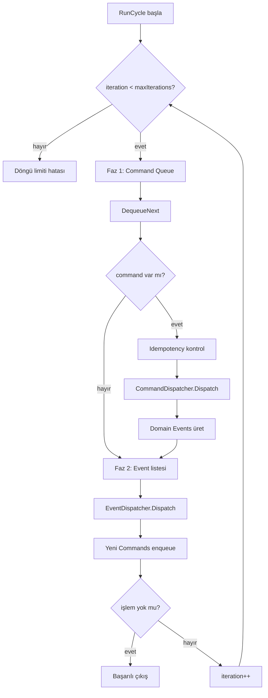
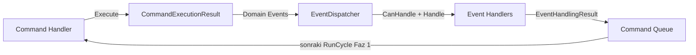

# 27. Sprint 1 — Transition Engine & Command Processor Foundation

> **Kapsam:** Application kernel — geçiş motoru, iki fazlı command processor, dispatcher'lar, idempotency. Broker/REST/trading yok.

## 27.1 Uygulanan Bileşenler

| # | Bileşen | Konum |
|---|---------|-------|
| 1 | `CTransitionRule` (+ Guard, Priority, ErrorCode) | `Domain/StateMachine/TransitionRule.mqh` |
| 2 | `CTransitionRuleRegistry` | `Application/Kernel/TransitionRuleRegistry.mqh` |
| 3 | `CTransitionEngine` | `Application/Kernel/TransitionEngine.mqh` |
| 4 | `CCommandProcessor` (two-phase) | `Application/Kernel/CommandProcessor.mqh` |
| 5 | `ICommandHandler` | `Application/Ports/ICommandHandler.mqh` |
| 6 | `IEventHandler` (CanHandle/Handle) | `Application/Ports/IEventHandler.mqh` |
| 7 | `CCommandDispatcher` | `Application/Kernel/CommandDispatcher.mqh` |
| 8 | `CEventDispatcher` | `Application/Kernel/EventDispatcher.mqh` |
| 9 | `IIdempotencyStore` + `CInMemoryIdempotencyStore` | `Application/Ports/`, `Infrastructure/Idempotency/` |
| 10 | Test utilities + 4 test scriptleri | `Include/BasketRecovery/Tests/`, `Scripts/BasketRecovery/Tests/` |

---

## 27.2 Klasör Ağacı (Sprint 1 eklemeleri)

```
mt5/
├── Include/BasketRecovery/
│   ├── Application/
│   │   ├── DTOs/
│   │   │   ├── CommandExecutionResult.mqh
│   │   │   └── EventHandlingResult.mqh
│   │   ├── Kernel/
│   │   │   ├── CommandDispatcher.mqh
│   │   │   ├── CommandProcessor.mqh
│   │   │   ├── DefaultTransitionRuleTable.mqh
│   │   │   ├── EventDispatcher.mqh
│   │   │   ├── TransitionEngine.mqh
│   │   │   └── TransitionRuleRegistry.mqh
│   │   └── Ports/
│   │       ├── ICommandHandler.mqh
│   │       ├── IIdempotencyPersistence.mqh
│   │       └── IIdempotencyStore.mqh
│   ├── Domain/StateMachine/
│   │   ├── AlwaysTrueTransitionGuard.mqh
│   │   ├── ITransitionGuard.mqh
│   │   └── TransitionResult.mqh
│   ├── Infrastructure/Idempotency/
│   │   └── InMemoryIdempotencyStore.mqh
│   └── Tests/
│       ├── TestAssert.mqh
│       ├── TransitionTestFixture.mqh
│       └── Handlers/
│           ├── KernelTestCreateBasketHandler.mqh
│           └── KernelTestBasketCreatedEventHandler.mqh
└── Scripts/BasketRecovery/Tests/
    ├── TestTransitionRules.mq5
    ├── TestCommandProcessor.mq5
    ├── TestDispatchers.mq5
    └── TestIdempotencyStore.mq5
```

---

## 27.3 Transition Tablosu (özet)

| Mevcut Durum | Olay | Sonraki Durum |
|--------------|------|---------------|
| PENDING_OPEN | InitialPositionsOpened | WAIT_DETAILS |
| PENDING_OPEN | CommandFailed | ERROR |
| PENDING_OPEN | CloseBasketRequested | CLOSING |
| WAIT_DETAILS | BasketActivated | ACTIVE |
| WAIT_DETAILS | WaitDetailsTimeout | CLOSING |
| WAIT_DETAILS | CloseBasketRequested | CLOSING |
| WAIT_DETAILS | CommandFailed | ERROR |
| ACTIVE | TP1Reached | TP1 |
| ACTIVE | MaxRiskReached | SUSPENDED |
| ACTIVE | CloseBasketRequested | CLOSING |
| ACTIVE | CommandFailed | ERROR |
| TP1 | BreakEvenActivated | BREAK_EVEN |
| TP1 | TP2Reached | TP2 |
| TP1 | CloseBasketRequested | CLOSING |
| BREAK_EVEN | TP2Reached | TP2 |
| BREAK_EVEN | AllPositionsClosed | FINISHED |
| BREAK_EVEN | CloseBasketRequested | CLOSING |
| TP2 | TP3Reached | TP3 |
| TP2 | CloseBasketRequested | CLOSING |
| TP3 | AllPositionsClosed | FINISHED |
| TP3 | BasketClosing | CLOSING |
| CLOSING | AllPositionsClosed | FINISHED |
| SUSPENDED | RiskReduced | ACTIVE |
| SUSPENDED | CloseBasketRequested | CLOSING |
| FINISHED / ERROR | *(tüm olaylar)* | *(reddedilir)* |

Tam tablo: `CDefaultTransitionRuleTable` + `ExportTable()`.

---

## 27.4 Command Flow ( iki fazlı döngü )



---

## 27.5 Event Flow



---

## 27.6 Test Senaryoları

| Script | Senaryo |
|--------|---------|
| `TestTransitionRules` | Registry validate, tablo-driven tüm kurallar, rejected events, duplicate detection, ExportTable |
| `TestDispatchers` | Command routing, event routing, eksik handler hataları |
| `TestIdempotencyStore` | Mark/lookup, duplicate mark, clear, empty key |
| `TestCommandProcessor` | Faz1 command→event, faz2 event→command zinciri, idempotency skip, loop limit |

---

## 27.7 Derleme Durumu

MetaEditor ortamında otomatik derleme bu oturumda çalıştırılmadı. Hedef: `BasketRecoveryEA.mq5` + 4 test scripti hatasız derlenir.

---

## 27.8 Sprint 2 için Kalan İş

- `StateTransitionHandler` — `CTransitionResult` → basket lifecycle uygulama (engine basket'i değiştirmez; handler uygular)
- Production `CommandHandler` / `EventHandler` implementasyonları (Create/Activate/Close)
- `CommandProcessor` → `ApplicationContext` / `OnTimer` entegrasyonu
- `IIdempotencyPersistence` file-backed implementasyonu
- `ModeTransitionRuleRegistry` (orthogonal mode flags)
- JSON profile loader (`JsonProfileLoader`)
- Command queue file persistence
