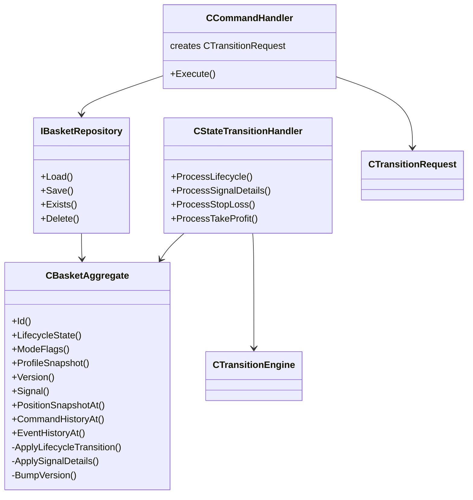

# 28. Sprint 2 — Basket Aggregate & Domain Handlers

> **Kapsam:** Basket aggregate tek doğruluk kaynağı; production command/event handler'lar; in-memory repository. Broker/REST/MT5 yok.

## 28.1 Aggregate Diyagramı



## 28.2 Mutation Flow

```
Command → CommandHandler
    → Load aggregate (repository)
    → Build CTransitionRequest
    → CStateTransitionHandler
        → CTransitionEngine.ApplyTransition (read-only)
        → CBasketAggregate.Apply* (sole mutator)
        → Audit record append + version++
    → CBasketValidator.Validate
    → Repository.Save
    → Domain events returned
```

## 28.3 Repository Tasarımı

| Operasyon | Davranış |
|-----------|----------|
| `Load` | Deep copy döner |
| `Save` | Insert veya replace (copy) |
| `Exists` | Key lookup |
| `Delete` | Remove + free |

Implementasyon: `CInMemoryBasketRepository` (Sprint 2). File-backed Sprint 3+.

## 28.4 Test Senaryoları

| Script | Senaryo |
|--------|---------|
| `TestBasketRepository` | Save/Load, update, delete, version, history |
| `TestBasketAggregate` | Create, activate, close, invalid transition, audit |

## 28.5 Sprint 3 — Tamamlandı

File-backed persistence: `docs/architecture/29-sprint-3-persistence.md`

## 28.6 Sprint 4 — Tamamlandı

REST command ingestion: `docs/architecture/30-sprint-4-rest-ingestion.md`

## 28.7 Sprint 5 için Kalan İş

- Bootstrapper wiring: `CPersistenceManager` → CommandProcessor / handlers
- OnTimer: `FlushIfDue()` entegrasyonu
- Broker reconciliation + trade executor
- REST API, Recovery engine, TP engine, Risk evaluation
