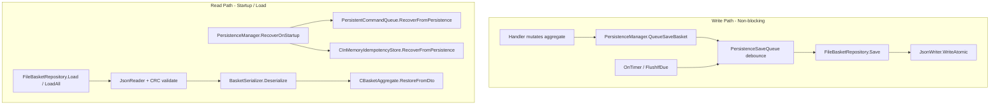

# 29. Sprint 3 — Persistence Layer

> **Kapsam:** Terminal restart sonrası basket state kaybı olmaması; tek file-backed storage katmanı. REST/broker/trading logic yok.

## 29.1 Klasör Ağacı

```
mt5/Include/BasketRecovery/
├── Shared/
│   ├── Constants/
│   │   ├── PersistenceSchema.mqh
│   │   └── ErrorCodes.mqh              (+9101–9106)
│   └── Utils/
│       └── Crc32.mqh
├── Domain/
│   ├── Aggregates/
│   │   └── BasketAggregate.mqh         (+RestoreFromDto)
│   └── Persistence/
│       └── BasketPersistenceDto.mqh
├── Application/
│   └── Ports/
│       ├── ICommandPersistence.mqh
│       └── IIdempotencyPersistence.mqh (mevcut)
└── Infrastructure/
    └── Persistence/
        ├── Json/
        │   ├── JsonWriter.mqh
        │   └── JsonReader.mqh
        ├── BasketSerializer.mqh
        ├── BasketMigration.mqh
        ├── FileBasketRepository.mqh
        ├── CommandSerializer.mqh
        ├── FileCommandPersistence.mqh
        ├── PersistentCommandQueue.mqh
        ├── FileIdempotencyPersistence.mqh
        ├── PersistenceSaveQueue.mqh
        └── PersistenceManager.mqh

mt5/Scripts/BasketRecovery/Tests/
└── TestPersistence.mq5
```

**Dosya sistemi (FILE_COMMON):**

```
MQL5/Files/BasketRecovery/persistence/
├── baskets/{basketId}.json
├── baskets/{basketId}.json.bak
├── commands/pending.json
└── idempotency/processed.json
```

## 29.2 Persistence Flow



## 29.3 Serialization Format (Schema v1)

```json
{
  "schema_version": 1,
  "crc32": "A1B2C3D4",
  "basket_id": "basket-001",
  "correlation_key": "corr-001",
  "direction": 1,
  "symbol": "XAUUSD",
  "lifecycle_state": 1,
  "recovery_active": false,
  "has_profile_snapshot": true,
  "profile_name": "default",
  "risk_target_pct": 1.0,
  "version": 1,
  "audit_command_ids": ["cmd-001"],
  "audit_event_ids": ["evt-001"],
  "audit_versions": [1],
  "audit_timestamps": [946684800],
  "position_versions": [],
  "position_updated_at": [],
  "position_open_counts": [],
  "position_tx_counts": []
}
```

| Alan | Açıklama |
|------|----------|
| `schema_version` | Zorunlu; migration giriş noktası |
| `crc32` | `schema_version` + body üzerinde CRC32 (hex) |
| Parallel arrays | Audit ve position snapshot — MQL5 JSON parser sınırları için |
| `.bak` | Her başarılı atomic write öncesi önceki dosya yedeklenir |

**Pending commands** (`commands/pending.json`):

```json
{
  "schema_version": 1,
  "crc32": "...",
  "pending_count": 1,
  "commands": [
    {
      "command_type": 1,
      "command_id": "cmd-001",
      "idempotency_key": "idem-001",
      "status": 0,
      "symbol": "XAUUSD"
    }
  ]
}
```

**Idempotency** (`idempotency/processed.json`):

```json
{
  "schema_version": 1,
  "crc32": "...",
  "processed_keys": ["idem-001", "idem-002"]
}
```

## 29.4 Recovery Flow

1. `CPersistenceManager::RecoverOnStartup()`
2. `CPersistentCommandQueue::RecoverFromPersistence()` — pending commands diskten memory'e
3. `CInMemoryIdempotencyStore::RecoverFromPersistence()` — processed keys diskten memory'e (persist etmeden)
4. Basket load ihtiyaç anında `FileBasketRepository::Load` / startup'ta `LoadAllBaskets`
5. **Recovery mode:** primary dosya yok/bozuk → `.bak` fallback (`CJsonReader::SetRecoveryMode`)

## 29.5 Migration Strategy

| Versiyon | Durum |
|----------|-------|
| v1 | Mevcut production format |
| v2+ | `CBasketMigration::MigrateToCurrent` hook — şu an yalnızca pass-through |
| Forward compat | `schema_version > BRE_PERSISTENCE_SCHEMA_VERSION` → `BRE_ERR_PERSIST_SCHEMA_UNSUPPORTED` |

Gelecek migration adımı: v1→v2 transform fonksiyonu `BasketMigration.mqh` switch'e eklenir; eski `.bak` dosyaları korunur.

## 29.6 Atomic Write

```
1. JSON → {file}.tmp
2. FileFlush
3. Mevcut {file} → {file}.bak
4. {file}.tmp → {file} (binary copy)
5. {file}.tmp sil
```

## 29.7 Performance

| Mekanizma | Davranış |
|-----------|----------|
| `QueueSaveBasket` | OnTick'te yalnızca memory queue — disk I/O yok |
| `PersistenceSaveQueue` | Default 500ms debounce |
| `FlushIfDue` | OnTimer'da çağrılır (Sprint 4 wiring) |
| Batch flush | Queue'daki tüm basket'ler tek timer tick'te yazılır |

## 29.8 Test Senaryoları

| Script | Senaryo |
|--------|---------|
| `TestPersistence` | Restart simulation |
| | Corrupted file (CRC mismatch) |
| | Missing file |
| | Partial write + `.bak` recovery |
| | Multiple baskets / LoadAll |
| | Migration v1 pass-through |
| | Pending command recovery |
| | Idempotency persistence |
| | Debounced batch save |

## 29.9 Derleme Durumu

MetaEditor derlemesi bu sprintte otomatik çalıştırılmadı. MT5'te `TestPersistence.mq5` script'ini çalıştırarak doğrulayın.

## 29.10 Sprint 4 — Tamamlandı

REST command ingestion: `docs/architecture/30-sprint-4-rest-ingestion.md`

## 29.11 Sprint 5 için Kalan İş

- Bootstrapper wiring: `CPersistenceManager` → CommandProcessor / handlers
- OnTimer: `FlushIfDue()` entegrasyonu
- Broker reconciliation + trade executor
- REST API
- Recovery engine + TP engine
- Risk evaluation loop
