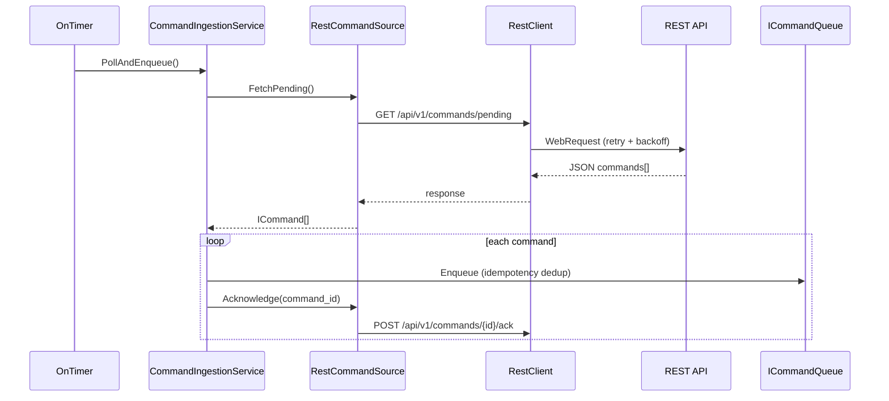

# 30. Sprint 4 — REST Command Ingestion

> **Kapsam:** Dış dünyadan sinyal/komut alımı; Command Queue'ya enqueue. Trade açılmaz; broker/Risk/Recovery/TP yok.

## 30.1 Klasör Ağacı

```
mt5/Include/BasketRecovery/
├── Application/
│   ├── Ports/
│   │   ├── ICommandSource.mqh
│   │   └── IRestHttpClient.mqh
│   └── Services/
│       └── CommandIngestionService.mqh
├── Shared/
│   └── DTOs/
│       └── RestHttpResponse.mqh
└── Infrastructure/
    └── Rest/
        ├── RestClientConfig.mqh
        ├── RestWebRequestClient.mqh
        ├── RestClient.mqh
        ├── ExponentialBackoff.mqh
        ├── RestCircuitBreaker.mqh
        ├── RestCommandJsonParser.mqh
        └── RestCommandSource.mqh

mt5/Include/BasketRecovery/Tests/
└── MockRestHttpClient.mqh

mt5/Scripts/BasketRecovery/Tests/
└── TestRestCommandSource.mq5
```

## 30.2 Ingestion Flow



## 30.3 Port Tasarımı

| Port | Sorumluluk |
|------|------------|
| `ICommandSource` | Pending komut fetch + ACK |
| `IRestHttpClient` | HTTP transport (mock veya WebRequest) |
| `CCommandIngestionService` | Dedup, enqueue, ack orchestration |

`CRestCommandSource` yalnızca `ICommand` üretir — Basket/Trade bilmez.

## 30.4 Endpoint Sözleşmesi

```
GET  {baseUrl}/api/v1/commands/pending?account_id={id}&since={cursor}
POST {baseUrl}/api/v1/commands/{command_id}/ack
Headers: Accept: application/json, X-API-Key: {key}
```

**Pending response örneği:**

```json
{
  "commands": [
    {
      "command_id": "cmd-001",
      "command_type": "CreateBasketCommand",
      "idempotency_key": "create:sig-001",
      "correlation_key": "corr-001",
      "symbol": "XAUUSD",
      "direction": "BUY",
      "signal_id": "sig-001",
      "priority": 30,
      "source": "REST"
    }
  ],
  "cursor": "cursor-001"
}
```

## 30.5 Dayanıklılık

| Mekanizma | Davranış |
|-----------|----------|
| Retry + exponential backoff | GET: 1s/2s/4s; POST ack: 1s…16s |
| Circuit breaker | 5 hata / 60s → 60s open |
| JSON validation | Zorunlu alanlar; geçersiz komut reddedilir |
| IdempotencyKey dedup | Queue'da mevcut key → skip + ack |
| OnTick | Ağ işlemi **yok** |
| OnTimer | Yalnızca REST poll (`EventSetMillisecondTimer`) |

## 30.6 EA Wiring

| Input | Açıklama |
|-------|----------|
| `InpApiBaseUrl` | Boş → REST disabled |
| `InpApiKey` | `X-API-Key` header |
| `InpRestPollIntervalMs` | 0 → profile `rest_poll_interval_ms` |

## 30.7 Test Senaryoları

| Script | Senaryo |
|--------|---------|
| `TestRestCommandSource` | Fetch + enqueue + ack |
| | IdempotencyKey duplicate |
| | Invalid JSON rejection |
| | 204 No Content |
| | Circuit breaker open |

Mock test: `CMockRestHttpClient` — gerçek HTTP gerekmez.

## 30.8 Derleme Durumu

MetaEditor derlemesi otomatik çalıştırılmadı. `TestRestCommandSource.mq5` ile doğrulayın.

## 30.9 Sprint 5 — Tamamlandı

Trade execution engine: `docs/architecture/31-sprint-5-trade-execution.md`

## 30.10 Sprint 6 için Kalan İş

- `CCommandProcessor` OnTimer fast loop wiring
- `CPersistenceManager` + `FlushIfDue()`
- Trade executor + OrderSend
- Broker reconciliation
- Risk / Recovery / TP engine
- Production handler processing loop
