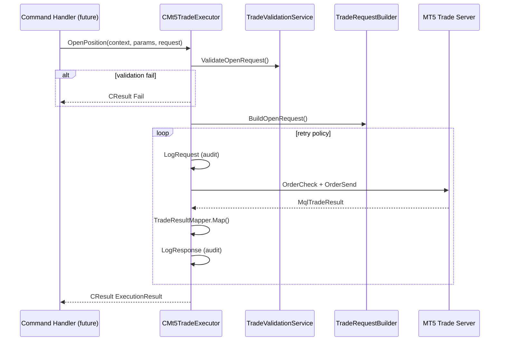

# 31. Sprint 5 — Trade Execution Engine

> **Kapsam:** MT5 broker gateway — tek execution katmanı. Risk/Recovery/TP/BE/strategy yok.

## 31.1 Klasör Ağacı

```
mt5/Include/BasketRecovery/
├── Application/
│   ├── Ports/ITradeExecutor.mqh
│   └── DTOs/
│       ├── TradeContext.mqh
│       └── ExecutionResult.mqh
├── Domain/Enums/TradeRole.mqh
└── Infrastructure/Execution/
    ├── ExecutionPolicy.mqh
    ├── TradeValidationService.mqh
    ├── TradeRequestBuilder.mqh
    ├── TradeResultMapper.mqh
    ├── ExecutionAuditLogger.mqh
    ├── Mt5TradeExecutor.mqh          ← ONLY OrderSend/OrderCheck/PositionSelect/OrderSelect
    └── MockTradeExecutor.mqh

mt5/Scripts/BasketRecovery/Tests/
└── TestExecution.mq5
```

## 31.2 Execution Flow



## 31.3 ExecutionResult Model

| Alan | Tip | Açıklama |
|------|-----|----------|
| `Success` | bool | Broker fill başarılı mı |
| `Retryable` | bool | Retry policy devam edebilir mi |
| `Status` | enum | FILLED / REJECTED / DRY_RUN / SIMULATED |
| `ErrorCode` | int | BRE_ERR_EXEC_* |
| `Ticket` / `Order` | ulong | Broker deal/order |
| `Price` / `Volume` | double | Fill bilgisi |
| `Retcode` | uint | TRADE_RETCODE_* |
| `LatencyMs` | int | OrderSend süresi |
| `AttemptCount` | int | Retry deneme sayısı |

## 31.4 Validation Flow

1. Symbol selected (`SymbolSelect`)
2. Volume min/max/step
3. Trading mode / market open (bid/ask > 0)
4. Stops level + freeze level
5. Margin (`OrderCalcMargin` + free margin)

Validation **Mt5TradeExecutor** içinde, broker send öncesi.

## 31.5 Retry Flow

| Retcode | Retry? |
|---------|--------|
| REQUOTE, PRICE_CHANGED, TIMEOUT, CONNECTION | Yes |
| REJECT, INVALID_VOLUME, NO_MONEY | No |

Policy: max 3 retry, 500ms delay (configurable).

DryRun / SimulationMode → broker'a gönderilmez.

## 31.6 Feature Flags

| Flag | Default | Davranış |
|------|---------|----------|
| `BRE_FEATURE_EXECUTION` | false | Live broker send |
| `BRE_FEATURE_DRY_RUN` | false | Build + audit, send yok |
| `BRE_FEATURE_MOCK_EXECUTION` | false | MockTradeExecutor wiring (Sprint 6) |
| `BRE_FEATURE_SIMULATION_MODE` | false | Simulated fill, send yok |

## 31.7 Test Senaryoları

| Script | Senaryo |
|--------|---------|
| `TestExecution` | Mock open success / rejection |
| | Result mapper success / retryable |
| | Request builder fields |
| | Dry run mode |
| | Execution disabled |
| | CloseBasket mock |

## 31.8 Broker API Kuralı

**Yalnızca `Mt5TradeExecutor.mqh` içinde:**
- `OrderSend`, `OrderCheck`, `PositionSelectByTicket`, `OrderSelect`

## 31.9 Derleme Durumu

MetaEditor derlemesi otomatik çalıştırılmadı. `TestExecution.mq5` ile doğrulayın.

## 31.10 Sprint 6 için Kalan İş

- Trade Request Queue → `CMt5TradeExecutor` wiring (OnTimer batch)
- Command handlers → TradeRequest enqueue
- `CPersistenceManager` + CommandProcessor fast loop
- Risk / Recovery / TP engine
- BrokerReconciliationService PositionSelect refactor (pre-existing violation)

---

## Quality Report

### Files Changed

| Dosya | Rol |
|-------|-----|
| `ITradeExecutor.mqh` | Port |
| `TradeContext.mqh`, `ExecutionResult.mqh` | DTOs |
| `TradeRole.mqh` | Enum |
| `ExecutionPolicy.mqh` | Retry/slippage/fill/flags |
| `TradeValidationService.mqh` | Pre-trade validation |
| `TradeRequestBuilder.mqh` | MqlTradeRequest builder |
| `TradeResultMapper.mqh` | Retcode normalization |
| `ExecutionAuditLogger.mqh` | Request/response/retry audit |
| `Mt5TradeExecutor.mqh` | Live broker gateway |
| `MockTradeExecutor.mqh` | Test double |
| `TestExecution.mq5` | Unit tests |
| `FeatureFlags.mqh`, `ErrorCodes.mqh` | Sprint 5 codes |

### LOC (approx.)

~1,200 satır yeni execution katmanı kodu + testler.

### Complexity

- Orta: retry loop + validation + audit tek executor'da
- Düşük: mapper, builder, policy ayrı sınıflar

### Architecture Violations

| Konum | Sorun | Sprint |
|-------|-------|--------|
| `BrokerReconciliationService.mqh` | `PositionSelectByTicket` — executor dışı | Pre-existing |
| `Mt5TradeTransactionNormalizer.mqh` | `OrderSelect` — executor dışı | Pre-existing |

Sprint 5 kapsamında yeni ihlal eklenmedi.

### Technical Debt

- Trade request queue → executor batch wiring (Sprint 6)
- Validation testleri symbol/market bağımlı (tester ortamında skip edilebilir)
- `PositionModify`/`PositionClose` MT5'te `OrderSend` ile — doğrudan API yok

### Ready for Sprint 6

| Kriter | Durum |
|--------|-------|
| ITradeExecutor port | ✅ |
| Mt5TradeExecutor broker gateway | ✅ |
| Mock executor + tests | ✅ |
| Queue/Handler wiring | ❌ Sprint 6 |
| Risk/Recovery/TP | ❌ Sprint 6+ |
