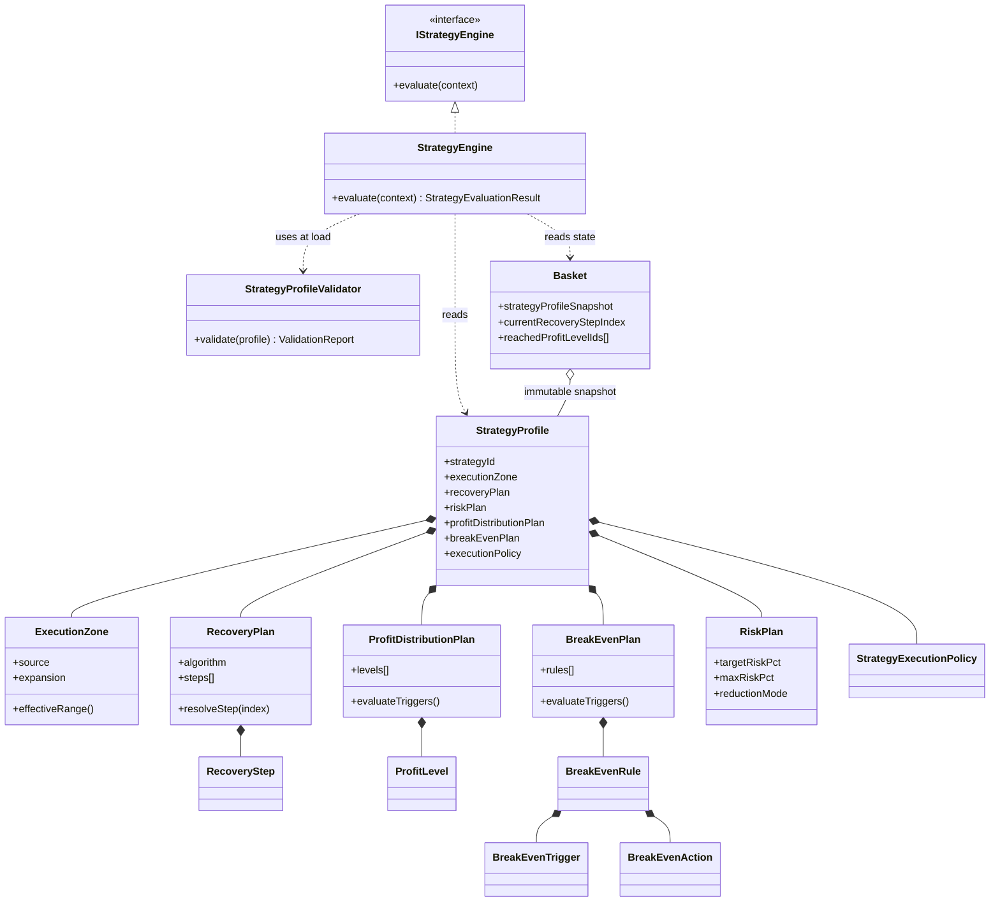
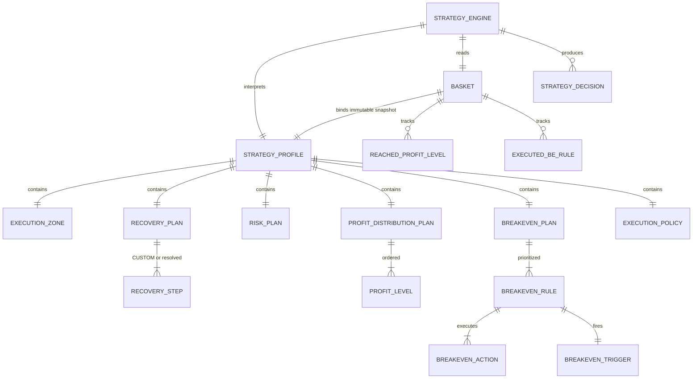
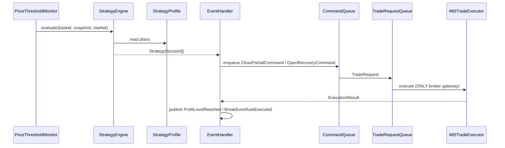

# 32. Strategy Domain Refactor — Generic Basket Trading Engine

> **Sprint türü:** Mimari refactor (kod yok)  
> **Durum:** Zorunlu — Sprint 5 execution ve sonraki engine implementasyonları **durduruldu**  
> **Kapsam:** Yalnızca Strategy katmanı evrilebilir. Infrastructure, Application Kernel, Trade Executor, Persistence, REST ingestion **değişmez**.

---

## 32.1 Problem Tanımı

Mevcut mimari **tek bir basket recovery stratejisine** göre tasarlanmış:

| Hard-coded öğe | Konum | Sorun |
|----------------|-------|-------|
| TP1 / TP2 / TP3 | Lifecycle states, TakeProfitPlanner, profile schema | Seviye sayısı sabit |
| Break-Even "TP1 sonrası" | Transition rules, Recovery disable matrix | TP numarasına bağımlı |
| Sabit recovery step (0.2 pip) | RecoveryProfileConfig | Algoritma değiştirilemez |
| `recovery_step_pips × stepIndex` | RecoveryEvaluator | Custom step dizisi yok |
| Ayrı profile dosyaları | risk / recovery / tp / breakeven | Strateji bütünlüğü yok |

**Hedef:** Kod değiştirmeden farklı basket yönetim stratejileri çalıştırabilen **Generic Basket Trading Engine**.

---

## 32.2 Çözüm Özeti

```
┌─────────────────────────────────────────────────────────────┐
│                    Strategy Profile (JSON)                   │
│  ExecutionZone · RecoveryPlan · RiskPlan ·                  │
│  ProfitDistributionPlan · BreakEvenPlan · ExecutionPolicy   │
└────────────────────────────┬────────────────────────────────┘
                             │ immutable bind at basket creation
                             ▼
┌─────────────────────────────────────────────────────────────┐
│                      Strategy Engine                         │
│  Pure evaluator — NO broker, NO persistence, NO hardcoded TP  │
│  Input: profile + basket + snapshot + market                  │
│  Output: StrategyDecision[] (commands/events to enqueue)      │
└────────────────────────────┬────────────────────────────────┘
                             │
         ┌───────────────────┼───────────────────┐
         ▼                   ▼                   ▼
   Command Handlers    Event Handlers    TransitionEngine
   (unchanged wiring)  (unchanged)       (generic milestone events)
```

**Prensip:** Business rules = **configuration**. Strategy Engine = **interpreter**.

---

## 32.3 Yeni Domain: Strategy

### 32.3.1 Klasör Yapısı (Planlanan)

```
Include/BasketRecovery/Domain/Strategy/
├── Aggregates/
│   └── StrategyProfile.mqh              # Immutable root — basket'e bağlanır
├── ValueObjects/
│   ├── ExecutionZone.mqh
│   ├── ZoneExpansion.mqh
│   ├── RecoveryStep.mqh
│   ├── RecoveryPlan.mqh
│   ├── ProfitLevel.mqh
│   ├── ProfitDistributionPlan.mqh
│   ├── BreakEvenTrigger.mqh
│   ├── BreakEvenAction.mqh
│   ├── BreakEvenRule.mqh
│   ├── BreakEvenPlan.mqh
│   ├── RiskPlan.mqh
│   └── StrategyExecutionPolicy.mqh      # Profile içi execution referansı
├── Enums/
│   ├── RecoveryAlgorithm.mqh            # CONSTANT | LINEAR | PROGRESSIVE | CUSTOM | ATR | VOLATILITY
│   ├── ZoneExpansionMode.mqh            # NONE | ABOVE | BELOW | SYMMETRIC | ASYMMETRIC
│   ├── CloseMode.mqh
│   ├── BreakEvenTriggerType.mqh
│   ├── BreakEvenActionType.mqh
│   ├── RiskReductionMode.mqh
│   └── ProfitTriggerType.mqh            # PRICE | FLOATING_PROFIT | REALIZED_PROFIT | RISK_PCT
├── Services/
│   ├── StrategyProfileValidator.mqh
│   ├── ExecutionZoneCalculator.mqh
│   ├── RecoveryPlanResolver.mqh         # Algorithm → resolved step sequence
│   ├── ProfitDistributionEvaluator.mqh
│   ├── BreakEvenEvaluator.mqh
│   ├── RiskPlanEvaluator.mqh
│   └── StrategyEngine.mqh               # Orchestrates evaluators
└── Decisions/
    ├── StrategyDecision.mqh             # Discriminated union
    └── StrategyEvaluationResult.mqh

Application/Ports/
└── IStrategyEngine.mqh                  # Port — handlers buradan çağırır

Infrastructure/Configuration/
├── StrategyProfileLoader.mqh            # JSON → StrategyProfile
├── StrategyProfileMigrator.mqh          # v1 profiles → v2 strategy
└── Schema/
    └── strategy-profile.schema.json
```

> **Not:** Bu sprint yalnızca mimari tanım içerir. Yukarıdaki dosyalar implementasyon sprint'inde oluşturulacaktır.

---

## 32.4 Domain Nesneleri

### 32.4.1 Execution Zone

Fiyat alanı: initial ve recovery pozisyonlarının açılabileceği bölge.

```
ExecutionZone
├── source: SIGNAL_RANGE | FIXED_RANGE | ATR_DERIVED (future)
├── signalRange: PriceRange | null          # Signal #1/#2'den
├── fixedRange: PriceRange | null
└── expansion: ZoneExpansion

ZoneExpansion
├── mode: NONE | ABOVE_ONLY | BELOW_ONLY | SYMMETRIC | ASYMMETRIC
├── aboveEntryPips: decimal | null
├── belowEntryPips: decimal | null
├── maxRecoveryDistancePips: decimal | null   # tavan mesafe
├── disabled: bool
└── futureAtr: AtrExpansionConfig | null        # reserved, schema-ready
    ├── period: int
    ├── multiplier: decimal
    └── timeframe: string
```

**Örnek (kullanıcı senaryosu):**

| Kaynak | Değer |
|--------|-------|
| Signal | SELL, range 4014 – 4017 |
| Expansion | +3 pip (symmetric) |
| Effective Recovery Zone | 4014 – 4020 |
| Max Recovery Distance | 20 pip (opsiyonel tavan) |

**Effective zone hesabı:**

```
effectiveLow  = signalLow  - belowExpansion
effectiveHigh = signalHigh + aboveExpansion
IF maxRecoveryDistancePips:
    clamp distance from anchor entry to effective bounds
```

Recovery açılışı yalnızca fiyat effective zone içindeyken değerlendirilir (guard).

---

### 32.4.2 Recovery Plan

Recovery sabit değil — **sıra (sequence)** olarak modellenir.

```
RecoveryPlan
├── algorithm: RecoveryAlgorithm
├── anchorMode: CUMULATIVE | RESET_ON_STEP | RESET_ON_RECOVERY
├── maxSteps: int | null                    # null = unlimited (memory cap in validator)
├── steps: RecoveryStep[]                   # CUSTOM ve resolved output
├── linearConfig: LinearRecoveryConfig | null
├── progressiveConfig: ProgressiveRecoveryConfig | null
├── atrConfig: AtrRecoveryConfig | null
├── volatilityConfig: VolatilityRecoveryConfig | null
├── allowDuringProfitTaking: bool
├── disableAfterBreakEven: bool
└── guards: RecoveryGuardConfig

RecoveryStep
├── stepIndex: int                          # 1-based
├── distancePips: decimal                   # anchor'dan adverse mesafe
├── lot: decimal
└── metadata: map<string, string>           # future extensions
```

**Algoritma davranışları:**

| Algorithm | Davranış |
|-----------|----------|
| `CONSTANT` | Tek step tanımı, `maxSteps` ile tekrar |
| `LINEAR` | `distance = base + (n-1)×increment`, lot sabit veya increment |
| `PROGRESSIVE` | Lot ve/veya distance non-linear artış (config curve) |
| `CUSTOM` | Explicit `steps[]` dizisi — sınırsız adım |
| `ATR` | `distance = ATR(period) × multiplier` per step (future) |
| `VOLATILITY_BASED` | Realized vol window (future) |

**Örnek CUSTOM sequence:**

| Step | Distance | Lot |
|------|----------|-----|
| 1 | 0.2 pip | 0.01 |
| 2 | 0.4 pip | 0.01 |
| 3 | 0.6 pip | 0.02 |
| 4 | 1.0 pip | 0.03 |

`RecoveryPlanResolver.resolve(plan, currentStepIndex)` → bir sonraki `RecoveryStep` veya `NONE`.

---

### 32.4.3 Profit Distribution Plan

TP1/TP2/TP3 yerine **sınırsız ProfitLevel** dizisi.

```
ProfitDistributionPlan
├── levels: ProfitLevel[]                 # sıralı, unlimited
├── requireFloatingProfitPositive: bool
├── defaultCloseMode: CloseMode           # level override yoksa
└── globalTrailing: TrailingConfig | null

ProfitLevel
├── levelId: string                         # stable id — events reference this
├── enabled: bool
├── order: int                              # evaluation order
├── trigger: ProfitTrigger
├── closePercent: decimal                   # 0–100, basket remaining volume
├── closeMode: CloseMode
├── partialClose: bool                      # false → closePercent ignored, close all at level
├── trailing: TrailingConfig | null         # future
└── lifecycleMilestone: string | null       # optional alias for transition engine

ProfitTrigger
├── type: PRICE | FLOATING_PROFIT_USD | REALIZED_PROFIT_USD | PERCENT_OF_TARGET_RISK
├── price: decimal | null
├── amountUsd: decimal | null
└── percentOfTargetRisk: decimal | null

TrailingConfig (future-ready)
├── enabled: bool
├── trailPips: decimal
└── activationOffsetPips: decimal

CloseMode (enum)
├── WORST_ENTRY_FIRST
├── BEST_ENTRY_FIRST
├── FIFO
├── LIFO
├── LARGEST_LOT_FIRST
├── SMALLEST_LOT_FIRST
├── PROFIT_BASED
└── RISK_BASED
```

**Önemli:** Lifecycle artık `TP1/TP2/TP3` değil; `ProfitLevelReached(levelId)` generic event'i kullanır.

---

### 32.4.4 BreakEven Plan

TP numarasına **bağımlı değil**. Trigger → Action rule listesi.

```
BreakEvenPlan
├── rules: BreakEvenRule[]                  # priority sıralı
└── defaultPriority: int

BreakEvenRule
├── ruleId: string
├── enabled: bool
├── priority: int                           # düşük = önce değerlendir
├── trigger: BreakEvenTrigger
├── actions: BreakEvenAction[]
├── runOnce: bool                           # default true
└── cooldownMs: int | null

BreakEvenTrigger
├── type: BreakEvenTriggerType
├── realizedProfitUsd: decimal | null
├── floatingProfitUsd: decimal | null
├── percentOfTargetRisk: decimal | null
├── profitLevelId: string | null          # SPECIFIC_PROFIT_LEVEL
├── basketState: string | null            # SPECIFIC_BASKET_STATE (e.g. ACTIVE)
├── eventType: string | null              # SPECIFIC_EVENT (e.g. RiskReduced)
└── manualToken: string | null            # MANUAL — REST command match

BreakEvenTriggerType
├── REALIZED_PROFIT
├── FLOATING_PROFIT
├── TARGET_RISK_REACHED
├── SPECIFIC_PROFIT_LEVEL
├── SPECIFIC_BASKET_STATE
├── SPECIFIC_EVENT
└── MANUAL

BreakEvenAction
├── type: BreakEvenActionType
├── slOffsetPips: decimal | null           # MOVE_SL_OFFSET
├── bufferPips: decimal | null             # MOVE_SL_TO_AVERAGE
├── includeSpread: bool
├── trailingConfig: TrailingConfig | null
└── targetRole: INITIAL | RECOVERY | ALL | null  # CLOSE_RECOVERY_POSITIONS
```

**Desteklenen action'lar:**

| Action | Açıklama |
|--------|----------|
| `MOVE_SL_TO_AVERAGE` | Weighted avg + buffer |
| `MOVE_SL_OFFSET` | Mevcut SL'den offset |
| `DISABLE_RECOVERY` | Kalıcı recovery kill switch |
| `ENABLE_TRAILING` | Trailing stop aktif (future) |
| `LOCK_BASKET` | Yeni işlem/recovery engelle |
| `CLOSE_RECOVERY_POSITIONS` | Recovery rolündeki pozisyonları kapat |

---

### 32.4.5 Risk Plan

```
RiskPlan
├── targetRiskPct: decimal
├── maxRiskPct: decimal
├── riskReductionThresholdPct: decimal | null   # maxRisk × threshold → lockout release
├── riskReductionMode: RiskReductionMode
├── breakEvenRealizedFraction: decimal | null   # legacy compat — prefer BreakEvenPlan
├── accountRiskCapPct: decimal | null           # future account aggregation
├── waitDetailsTimeoutMinutes: int
├── waitDetailsEmergencyAction: CLOSE_ALL | SUSPEND | NONE
└── evalDebounceMs: int

RiskReductionMode
├── WORST_ENTRY
├── BEST_ENTRY
├── FIFO
├── PROFIT_BASED
└── RISK_BASED
```

Risk Engine **hesaplama** yapar; eşik ve mod **RiskPlan**'dan gelir.

---

### 32.4.6 Strategy Profile (Aggregate Root)

```
StrategyProfile (immutable after bind)
├── strategyId: string
├── strategyName: string
├── schemaVersion: int
├── executionZone: ExecutionZone
├── recoveryPlan: RecoveryPlan
├── riskPlan: RiskPlan
├── profitDistributionPlan: ProfitDistributionPlan
├── breakEvenPlan: BreakEvenPlan
├── executionPolicy: StrategyExecutionPolicy
├── boundAt: datetime | null              # set on snapshot
└── checksum: string                        # integrity

StrategyExecutionPolicy
├── slippagePoints: int
├── maxTradeRetries: int
├── executionTimeoutMs: int
├── magicNumberBase: int
├── commandBatchSize: int
└── tradeRequestBatchSize: int
```

**Basket ilişkisi:**

```
Basket
├── strategyProfileSnapshot: StrategyProfile   # TEK immutable referans
├── currentRecoveryStepIndex: int
├── reachedProfitLevelIds: string[]
├── executedBreakEvenRuleIds: string[]
└── ... (mevcut alanlar korunur)
```

Eski `ProfileSnapshot { risk, recovery, takeProfit, breakEven }` → **deprecated**, `StrategyProfile` ile değiştirilir.

---

## 32.5 Strategy Engine

### 32.5.1 Sorumluluk

| Yapar | Yapmaz |
|-------|--------|
| Plan değerlendirme | OrderSend / broker API |
| StrategyDecision üretme | Persistence |
| Zone / step / level hesaplama | REST transport |
| Guard chain (config-driven) | Hard-coded TP1/TP2/TP3 |

### 32.5.2 Evaluation Pipeline

```
StrategyEngine.evaluate(context):
    1. ExecutionZoneCalculator.isPriceInZone(market, zone) → guard
    2. RiskPlanEvaluator.evaluate(riskPlan, snapshot) → RiskDecision?
    3. RecoveryPlanResolver.nextStep(recoveryPlan, stepIndex) → RecoveryDecision?
    4. ProfitDistributionEvaluator.evaluate(plan, basket) → ProfitLevelDecision?
    5. BreakEvenEvaluator.evaluate(plan, basket, events) → BreakEvenDecision?
    6. Merge + dedupe by priority
    7. RETURN StrategyEvaluationResult
```

### 32.5.3 StrategyDecision (Output Union)

```
StrategyDecision (discriminated)
├── OPEN_RECOVERY          { stepIndex, lot, priceZone }
├── CLOSE_PARTIAL          { levelId, closePercent, closeMode, tickets[] }
├── CLOSE_ALL              { reason }
├── REDUCE_RISK            { mode, tickets[] }
├── MOVE_STOP_LOSS         { newSl, syncAll }
├── DISABLE_RECOVERY       { permanent }
├── ENABLE_TRAILING        { config }
├── LOCK_BASKET            { reason }
├── CLOSE_RECOVERY_ONLY      { tickets[] }
├── EMIT_MILESTONE         { levelId | ruleId }
└── NO_OP
```

Application Event Handlers bu kararları mevcut Command/TradeRequest enqueue pattern'ine çevirir — **handler wiring değişmez**, yalnızca karar kaynağı Strategy Engine olur.

---

## 32.6 Class Diagram



---

## 32.7 İlişkiler



| İlişki | Kardinalite | Kural |
|--------|-------------|-------|
| Basket → StrategyProfile | 1:1 snapshot | Oluşturmada bind; runtime değişmez |
| StrategyProfile → Plans | 1:1 each | Tüm planlar zorunlu (boş plan = valid empty config) |
| ProfitLevel → BreakEvenTrigger | N:M | `profitLevelId` referansı |
| RecoveryPlan → RecoveryStep | 1:N | CUSTOM explicit; diğerleri resolver ile |
| StrategyEngine → Handlers | 1:N | Decisions → existing command pattern |

---

## 32.8 JSON Schema (Strategy Profile v2)

### 32.8.1 Root Document

```json
{
  "$schema": "https://json-schema.org/draft/2020-12/schema",
  "$id": "https://basket-recovery.local/schemas/strategy-profile/v2",
  "title": "StrategyProfile",
  "type": "object",
  "required": [
    "schemaVersion",
    "strategyId",
    "strategyName",
    "executionZone",
    "recoveryPlan",
    "riskPlan",
    "profitDistributionPlan",
    "breakEvenPlan",
    "executionPolicy"
  ],
  "additionalProperties": false,
  "properties": {
    "schemaVersion": { "type": "integer", "const": 2 },
    "strategyId": { "type": "string", "pattern": "^[a-z0-9][a-z0-9-_]{2,63}$" },
    "strategyName": { "type": "string", "minLength": 1, "maxLength": 128 },
    "executionZone": { "$ref": "#/$defs/ExecutionZone" },
    "recoveryPlan": { "$ref": "#/$defs/RecoveryPlan" },
    "riskPlan": { "$ref": "#/$defs/RiskPlan" },
    "profitDistributionPlan": { "$ref": "#/$defs/ProfitDistributionPlan" },
    "breakEvenPlan": { "$ref": "#/$defs/BreakEvenPlan" },
    "executionPolicy": { "$ref": "#/$defs/ExecutionPolicy" }
  },
  "$defs": {
    "ExecutionZone": {
      "type": "object",
      "required": ["source", "expansion"],
      "properties": {
        "source": { "enum": ["SIGNAL_RANGE", "FIXED_RANGE", "ATR_DERIVED"] },
        "fixedRange": {
          "type": ["object", "null"],
          "properties": {
            "low": { "type": "number" },
            "high": { "type": "number" }
          }
        },
        "expansion": { "$ref": "#/$defs/ZoneExpansion" }
      }
    },
    "ZoneExpansion": {
      "type": "object",
      "required": ["mode", "disabled"],
      "properties": {
        "mode": { "enum": ["NONE", "ABOVE_ONLY", "BELOW_ONLY", "SYMMETRIC", "ASYMMETRIC"] },
        "aboveEntryPips": { "type": ["number", "null"], "minimum": 0 },
        "belowEntryPips": { "type": ["number", "null"], "minimum": 0 },
        "maxRecoveryDistancePips": { "type": ["number", "null"], "minimum": 0 },
        "disabled": { "type": "boolean" },
        "futureAtr": {
          "type": ["object", "null"],
          "properties": {
            "period": { "type": "integer", "minimum": 1 },
            "multiplier": { "type": "number", "minimum": 0 },
            "timeframe": { "type": "string" }
          }
        }
      }
    },
    "RecoveryPlan": {
      "type": "object",
      "required": ["algorithm", "anchorMode", "allowDuringProfitTaking", "disableAfterBreakEven"],
      "properties": {
        "algorithm": { "enum": ["CONSTANT", "LINEAR", "PROGRESSIVE", "CUSTOM", "ATR", "VOLATILITY_BASED"] },
        "anchorMode": { "enum": ["CUMULATIVE", "RESET_ON_STEP", "RESET_ON_RECOVERY"] },
        "maxSteps": { "type": ["integer", "null"], "minimum": 1 },
        "steps": {
          "type": "array",
          "items": { "$ref": "#/$defs/RecoveryStep" }
        },
        "linearConfig": { "type": ["object", "null"] },
        "progressiveConfig": { "type": ["object", "null"] },
        "atrConfig": { "type": ["object", "null"] },
        "allowDuringProfitTaking": { "type": "boolean" },
        "disableAfterBreakEven": { "type": "boolean" }
      }
    },
    "RecoveryStep": {
      "type": "object",
      "required": ["stepIndex", "distancePips", "lot"],
      "properties": {
        "stepIndex": { "type": "integer", "minimum": 1 },
        "distancePips": { "type": "number", "minimum": 0 },
        "lot": { "type": "number", "exclusiveMinimum": 0 }
      }
    },
    "RiskPlan": {
      "type": "object",
      "required": ["targetRiskPct", "maxRiskPct", "riskReductionMode"],
      "properties": {
        "targetRiskPct": { "type": "number", "exclusiveMinimum": 0 },
        "maxRiskPct": { "type": "number", "exclusiveMinimum": 0 },
        "riskReductionThresholdPct": { "type": ["number", "null"], "minimum": 0, "maximum": 1 },
        "riskReductionMode": {
          "enum": ["WORST_ENTRY", "BEST_ENTRY", "FIFO", "PROFIT_BASED", "RISK_BASED"]
        },
        "accountRiskCapPct": { "type": ["number", "null"] },
        "waitDetailsTimeoutMinutes": { "type": "integer", "minimum": 1 },
        "waitDetailsEmergencyAction": { "enum": ["CLOSE_ALL", "SUSPEND", "NONE"] },
        "evalDebounceMs": { "type": "integer", "minimum": 0 }
      }
    },
    "ProfitDistributionPlan": {
      "type": "object",
      "required": ["levels"],
      "properties": {
        "levels": {
          "type": "array",
          "items": { "$ref": "#/$defs/ProfitLevel" }
        },
        "requireFloatingProfitPositive": { "type": "boolean", "default": true },
        "defaultCloseMode": {
          "enum": ["WORST_ENTRY_FIRST", "BEST_ENTRY_FIRST", "FIFO", "LIFO",
                   "LARGEST_LOT_FIRST", "SMALLEST_LOT_FIRST", "PROFIT_BASED", "RISK_BASED"]
        }
      }
    },
    "ProfitLevel": {
      "type": "object",
      "required": ["levelId", "enabled", "order", "trigger", "closePercent", "closeMode", "partialClose"],
      "properties": {
        "levelId": { "type": "string", "pattern": "^[A-Z0-9][A-Z0-9-_]{0,31}$" },
        "enabled": { "type": "boolean" },
        "order": { "type": "integer", "minimum": 0 },
        "trigger": { "$ref": "#/$defs/ProfitTrigger" },
        "closePercent": { "type": "number", "minimum": 0, "maximum": 100 },
        "closeMode": { "enum": ["WORST_ENTRY_FIRST", "BEST_ENTRY_FIRST", "FIFO", "LIFO",
                                 "LARGEST_LOT_FIRST", "SMALLEST_LOT_FIRST", "PROFIT_BASED", "RISK_BASED"] },
        "partialClose": { "type": "boolean" },
        "trailing": { "type": ["object", "null"] },
        "lifecycleMilestone": { "type": ["string", "null"] }
      }
    },
    "ProfitTrigger": {
      "type": "object",
      "required": ["type"],
      "properties": {
        "type": { "enum": ["PRICE", "FLOATING_PROFIT_USD", "REALIZED_PROFIT_USD", "PERCENT_OF_TARGET_RISK"] },
        "price": { "type": ["number", "null"] },
        "amountUsd": { "type": ["number", "null"] },
        "percentOfTargetRisk": { "type": ["number", "null"], "minimum": 0, "maximum": 100 }
      }
    },
    "BreakEvenPlan": {
      "type": "object",
      "required": ["rules"],
      "properties": {
        "rules": {
          "type": "array",
          "items": { "$ref": "#/$defs/BreakEvenRule" }
        }
      }
    },
    "BreakEvenRule": {
      "type": "object",
      "required": ["ruleId", "enabled", "priority", "trigger", "actions"],
      "properties": {
        "ruleId": { "type": "string" },
        "enabled": { "type": "boolean" },
        "priority": { "type": "integer" },
        "trigger": { "$ref": "#/$defs/BreakEvenTrigger" },
        "actions": {
          "type": "array",
          "minItems": 1,
          "items": { "$ref": "#/$defs/BreakEvenAction" }
        },
        "runOnce": { "type": "boolean", "default": true },
        "cooldownMs": { "type": ["integer", "null"], "minimum": 0 }
      }
    },
    "BreakEvenTrigger": {
      "type": "object",
      "required": ["type"],
      "properties": {
        "type": {
          "enum": ["REALIZED_PROFIT", "FLOATING_PROFIT", "TARGET_RISK_REACHED",
                   "SPECIFIC_PROFIT_LEVEL", "SPECIFIC_BASKET_STATE", "SPECIFIC_EVENT", "MANUAL"]
        },
        "realizedProfitUsd": { "type": ["number", "null"] },
        "floatingProfitUsd": { "type": ["number", "null"] },
        "percentOfTargetRisk": { "type": ["number", "null"] },
        "profitLevelId": { "type": ["string", "null"] },
        "basketState": { "type": ["string", "null"] },
        "eventType": { "type": ["string", "null"] }
      }
    },
    "BreakEvenAction": {
      "type": "object",
      "required": ["type"],
      "properties": {
        "type": {
          "enum": ["MOVE_SL_TO_AVERAGE", "MOVE_SL_OFFSET", "DISABLE_RECOVERY",
                   "ENABLE_TRAILING", "LOCK_BASKET", "CLOSE_RECOVERY_POSITIONS"]
        },
        "slOffsetPips": { "type": ["number", "null"] },
        "bufferPips": { "type": ["number", "null"] },
        "includeSpread": { "type": "boolean" },
        "targetRole": { "enum": ["INITIAL", "RECOVERY", "ALL", null] }
      }
    },
    "ExecutionPolicy": {
      "type": "object",
      "required": ["slippagePoints", "maxTradeRetries", "executionTimeoutMs", "magicNumberBase"],
      "properties": {
        "slippagePoints": { "type": "integer", "minimum": 0 },
        "maxTradeRetries": { "type": "integer", "minimum": 0 },
        "executionTimeoutMs": { "type": "integer", "minimum": 0 },
        "magicNumberBase": { "type": "integer" },
        "commandBatchSize": { "type": "integer", "minimum": 1 },
        "tradeRequestBatchSize": { "type": "integer", "minimum": 1 }
      }
    }
  }
}
```

### 32.8.2 Örnek: Mevcut Default Stratejinin v2 Karşılığı

```json
{
  "schemaVersion": 2,
  "strategyId": "default-recovery-v1",
  "strategyName": "Legacy Default — 3 TP + BE after L1",
  "executionZone": {
    "source": "SIGNAL_RANGE",
    "fixedRange": null,
    "expansion": {
      "mode": "SYMMETRIC",
      "aboveEntryPips": 3,
      "belowEntryPips": 0,
      "maxRecoveryDistancePips": null,
      "disabled": false,
      "futureAtr": null
    }
  },
  "recoveryPlan": {
    "algorithm": "LINEAR",
    "anchorMode": "CUMULATIVE",
    "maxSteps": 50,
    "steps": [],
    "linearConfig": {
      "baseDistancePips": 0.2,
      "distanceIncrementPips": 0.2,
      "baseLot": 0.01,
      "lotIncrement": 0
    },
    "allowDuringProfitTaking": true,
    "disableAfterBreakEven": true
  },
  "riskPlan": {
    "targetRiskPct": 1.0,
    "maxRiskPct": 1.2,
    "riskReductionThresholdPct": 0.95,
    "riskReductionMode": "WORST_ENTRY",
    "waitDetailsTimeoutMinutes": 30,
    "waitDetailsEmergencyAction": "CLOSE_ALL",
    "evalDebounceMs": 100
  },
  "profitDistributionPlan": {
    "requireFloatingProfitPositive": true,
    "defaultCloseMode": "WORST_ENTRY_FIRST",
    "levels": [
      {
        "levelId": "L1",
        "enabled": true,
        "order": 1,
        "trigger": { "type": "PRICE", "price": null },
        "closePercent": 33,
        "closeMode": "WORST_ENTRY_FIRST",
        "partialClose": true,
        "trailing": null,
        "lifecycleMilestone": "MILESTONE_1"
      },
      {
        "levelId": "L2",
        "enabled": true,
        "order": 2,
        "trigger": { "type": "PRICE", "price": null },
        "closePercent": 66,
        "closeMode": "WORST_ENTRY_FIRST",
        "partialClose": true,
        "trailing": null,
        "lifecycleMilestone": "MILESTONE_2"
      },
      {
        "levelId": "L3",
        "enabled": true,
        "order": 3,
        "trigger": { "type": "PRICE", "price": null },
        "closePercent": 100,
        "closeMode": "WORST_ENTRY_FIRST",
        "partialClose": false,
        "trailing": null,
        "lifecycleMilestone": "MILESTONE_3"
      }
    ]
  },
  "breakEvenPlan": {
    "rules": [
      {
        "ruleId": "BE_AFTER_L1",
        "enabled": true,
        "priority": 10,
        "trigger": { "type": "SPECIFIC_PROFIT_LEVEL", "profitLevelId": "L1" },
        "actions": [
          { "type": "MOVE_SL_TO_AVERAGE", "bufferPips": 0.5, "includeSpread": true },
          { "type": "DISABLE_RECOVERY" }
        ],
        "runOnce": true
      }
    ]
  },
  "executionPolicy": {
    "slippagePoints": 10,
    "maxTradeRetries": 3,
    "executionTimeoutMs": 5000,
    "magicNumberBase": 202606000,
    "commandBatchSize": 10,
    "tradeRequestBatchSize": 5
  }
}
```

> **Not:** L1/L2/L3 `trigger.price` değerleri sinyal #2'den runtime'da `SignalDetails` ile merge edilir — strateji profili fiyatı override edebilir veya `SIGNAL_TP` referans modunu destekler (implementasyon sprint'inde).

### 32.8.3 Manifest (v2)

```json
{
  "manifestVersion": 2,
  "strategies": {
    "default-recovery-v1": {
      "file": "strategies/default-recovery-v1.strategy.json",
      "description": "Legacy-compatible 3-level profit + BE",
      "active": true
    },
    "grid-recovery-custom": {
      "file": "strategies/grid-recovery-custom.strategy.json",
      "description": "4-step custom recovery grid"
    }
  },
  "defaultStrategyId": "default-recovery-v1",
  "symbolOverrides": {
    "XAUUSD": "default-recovery-v1"
  }
}
```

**Dosya konumu:**

```
MQL5/Files/BasketRecovery/
├── strategies/
│   ├── default-recovery-v1.strategy.json
│   └── grid-recovery-custom.strategy.json
└── manifest.json
```

---

## 32.9 Validation Rules

### 32.9.1 Profile-Level

| Kural | Hata kodu | Açıklama |
|-------|-----------|----------|
| `schemaVersion == 2` | `STRATEGY_SCHEMA_UNSUPPORTED` | Bilinmeyen versiyon → fail |
| `strategyId` unique in manifest | `STRATEGY_DUPLICATE_ID` | Manifest çakışması |
| All required sections present | `STRATEGY_INCOMPLETE` | Eksik plan |
| JSON schema pass | `STRATEGY_SCHEMA_INVALID` | Structural validation |

### 32.9.2 Risk Plan

| Kural | Kod |
|-------|-----|
| `maxRiskPct >= targetRiskPct` | `RISK_MAX_BELOW_TARGET` |
| `targetRiskPct > 0` | `RISK_INVALID_TARGET` |
| `riskReductionThresholdPct ∈ [0,1]` if set | `RISK_INVALID_THRESHOLD` |

### 32.9.3 Recovery Plan

| Kural | Kod |
|-------|-----|
| CUSTOM → `steps.length >= 1` | `RECOVERY_EMPTY_STEPS` |
| Step indices strictly increasing | `RECOVERY_STEP_ORDER` |
| Distance monotonic non-decreasing (CUSTOM) | `RECOVERY_DISTANCE_REGRESSION` |
| `maxSteps >= steps.length` if both set | `RECOVERY_MAX_STEPS_CONFLICT` |
| LINEAR/PROGRESSIVE → required config present | `RECOVERY_ALGO_CONFIG_MISSING` |
| ATR/VOLATILITY → flagged `future`; load warning if enabled without engine | `RECOVERY_ALGO_NOT_AVAILABLE` |
| All lots >= symbol min lot (at bind time) | `RECOVERY_LOT_BELOW_MIN` |

### 32.9.4 Profit Distribution Plan

| Kural | Kod |
|-------|-----|
| `levelId` unique within plan | `PROFIT_DUPLICATE_LEVEL_ID` |
| `order` unique within enabled levels | `PROFIT_DUPLICATE_ORDER` |
| Unlimited levels allowed | — |
| Sum of **remaining-close** percents ≤ 100 per evaluation wave | `PROFIT_PERCENT_OVERFLOW` |
| Disabled levels skipped in sum | — |
| `partialClose=false` → closePercent should be 100 | `PROFIT_PARTIAL_MISMATCH` (warning) |
| PRICE trigger → price required unless SIGNAL-bound | `PROFIT_PRICE_REQUIRED` |

### 32.9.5 BreakEven Plan

| Kural | Kod |
|-------|-----|
| `ruleId` unique | `BE_DUPLICATE_RULE` |
| Each rule ≥ 1 action | `BE_EMPTY_ACTIONS` |
| `SPECIFIC_PROFIT_LEVEL` → `profitLevelId` exists in plan | `BE_UNKNOWN_PROFIT_LEVEL` |
| `SPECIFIC_BASKET_STATE` → known lifecycle state | `BE_UNKNOWN_STATE` |
| Trigger/action type compatibility matrix | `BE_INCOMPATIBLE_ACTION` |
| No circular trigger dependency | `BE_CIRCULAR_RULE` |

### 32.9.6 Execution Zone

| Kural | Kod |
|-------|-----|
| FIXED_RANGE → low < high | `ZONE_INVALID_RANGE` |
| ASYMMETRIC → both above and below required | `ZONE_ASYMMETRIC_INCOMPLETE` |
| `maxRecoveryDistancePips > 0` if set | `ZONE_INVALID_MAX_DISTANCE` |

### 32.9.7 Cross-Plan Consistency

| Kural | Kod |
|-------|-----|
| BreakEven `profitLevelId` refs ⊆ ProfitDistribution levels | `PROFILE_BE_PROFIT_REF` |
| Recovery `disableAfterBreakEven` + BE `DISABLE_RECOVERY` action → consistent | warning only |
| Execution policy magic ≠ 0 | `EXEC_INVALID_MAGIC` |
| Profile checksum matches on persistence restore | `PROFILE_CHECKSUM_MISMATCH` |

Validation **startup'ta zorunlu** — mevcut profile validation pattern korunur (`IConfigurationProfileLoader.validate` → genişletilir veya `IStrategyProfileLoader`).

---

## 32.10 Migration Strategy

### 32.10.1 v1 → v2 Profile Migration

```
StrategyProfileMigrator.migrate(v1Bundle):
    strategy = new StrategyProfile()
    strategy.riskPlan        ← map(risk.profile.json)
    strategy.recoveryPlan    ← map(recovery.profile.json) + algorithm inference
    strategy.profitDistribution ← map(takeprofit.profile.json) → L1/L2/L3 levels
    strategy.breakEvenPlan   ← map(breakeven.profile.json) + infer trigger from legacy
    strategy.executionPolicy ← map(execution.profile.json)
    strategy.executionZone   ← defaults (SYMMETRIC +3 pip) unless manifest override
    RETURN strategy
```

| v1 Field | v2 Target |
|----------|-----------|
| `tp1_realize_fraction: 0.33` | ProfitLevel L1 closePercent: 33 |
| `tp2_realize_fraction: 0.66` | ProfitLevel L2 closePercent: 66 |
| `tp3_action: CLOSE_ALL` | ProfitLevel L3 partialClose: false |
| `recovery_step_pips: 0.2` | RecoveryPlan LINEAR baseDistancePips |
| `break_even_realized_fraction: 0.33` | BreakEvenTrigger REALIZED_PROFIT or SPECIFIC_PROFIT_LEVEL |
| `partial_close_ranking` | ProfitLevel.closeMode |

### 32.10.2 Persistence Migration

```
BasketPersistenceDto v3:
    - Replace profileSnapshot with strategyProfileSnapshot (JSON blob + checksum)
    - Add reachedProfitLevelIds[], executedBreakEvenRuleIds[]
    - Keep currentRecoveryStepIndex

BasketMigration v2→v3:
    - On load: if old profile format → migrate in memory → persist v3
```

### 32.10.3 Transition Rule Migration

| v1 Event | v2 Event |
|----------|----------|
| `TP1Reached` | `ProfitLevelReached { levelId: "L1" }` |
| `TP2Reached` | `ProfitLevelReached { levelId: "L2" }` |
| `TP3Reached` | `ProfitLevelReached { levelId: "L3" }` |
| `BreakEvenActivated` | `BreakEvenRuleExecuted { ruleId }` |

TransitionRuleRegistry: generic events + **legacy alias adapter** (log deprecation).

### 32.10.4 Lifecycle State Evolution

**Faz 1 (compat):** Mevcut `TP1/TP2/TP3` lifecycle state isimleri korunur; `lifecycleMilestone` mapping ile generic profile'a bağlanır.

**Faz 2 (target):** Lifecycle sadeleştirilir:

```
PENDING_OPEN → WAIT_DETAILS → ACTIVE → PROFIT_TAKING* → BREAK_EVEN → CLOSING → FINISHED
```

`*PROFIT_TAKING` — internal sub-state: `currentProfitLevelIndex` basket'te tracked.

---

## 32.11 Backward Compatibility

| Alan | Uyumluluk |
|------|-----------|
| Mevcut basket aggregate | `BindProfileSnapshot` → `BindStrategyProfile` alias; eski DTO migrate |
| REST command ingestion | Değişmez — command shape aynı |
| Trade Executor (Sprint 5 kodu) | Değişmez — yalnızca TradeContext.recoveryStep profile'dan gelir |
| Persistence file layout | v3 schema; auto-migrate v2 |
| Feature flags | TP1/TP2/TP3 flags deprecated → `BRE_FEATURE_STRATEGY_ENGINE` |
| Test fixtures | `ProfileBundle` test data → `StrategyProfile` factory |
| Python signal API | Değişmez |
| State machine UI/logging | Legacy milestone aliases (L1→TP1 log label) |

**Garanti:** Mevcut `default` profile davranışı v2 `default-recovery-v1.strategy.json` ile **semantik eşdeğer** olmalı (golden test).

---

## 32.12 Refactoring Impact

### 32.12.1 Değişmeyen Katmanlar

| Katman | Durum |
|--------|-------|
| Infrastructure/Execution (Mt5TradeExecutor) | **Frozen** |
| Infrastructure/Rest | **Frozen** |
| Infrastructure/Persistence (format hariç migrate) | **Minimal** |
| Application/Kernel (CommandProcessor, EventBus) | **Frozen** |
| Application/CommandHandlers (wiring) | **Frozen** — karar kaynağı değişir |
| Domain/StateMachine engine | **Event isimleri genişler** |
| Domain/Entities/BasketPosition | **Frozen** |

### 32.12.2 Değişen / Eklenecek

| Bileşen | Etki |
|---------|------|
| `Domain/Strategy/*` | **Yeni** — tüm business rule modelleri |
| `Domain/Services/TakeProfitPlanner` | **Deprecated** → ProfitDistributionEvaluator |
| `Domain/Services/RecoveryEvaluator` | **Deprecated** → RecoveryPlanResolver |
| `Domain/Services/BreakEvenCalculator` | **Deprecated** → BreakEvenEvaluator |
| `Domain/ValueObjects/TakeProfitLevels.mqh` | **Deprecated** |
| `Domain/ValueObjects/RecoveryConfig.mqh` | **Deprecated** |
| `ProfileSnapshot` | **Replaced** by StrategyProfile |
| `TransitionRuleRegistry` | Generic milestone events |
| `docs/08,09,10,23` | Superseded by doc 32 + amendments |

### 32.12.3 Risk Matrisi

| Risk | Olasılık | Azaltma |
|------|----------|---------|
| Migration semantik drift | Orta | Golden tests v1 vs v2 |
| State machine regression | Orta | Legacy event alias layer |
| Profile validation gaps | Düşük | JSON schema + cross-plan validator |
| Scope creep into execution | Orta | Sprint gate: Strategy-only PR |

---

## 32.13 Implementation Roadmap

### Sprint R-1: Strategy Domain Foundation (Implementasyon)

```
Deliverables:
  ├── Domain/Strategy value objects + enums
  ├── StrategyProfile aggregate + immutable snapshot
  ├── StrategyProfileValidator (all rules §32.9)
  ├── strategy-profile.schema.json
  ├── StrategyProfileLoader (Infrastructure)
  ├── StrategyProfileMigrator v1→v2
  ├── default-recovery-v1.strategy.json (golden)
  └── TestStrategyProfileValidator.mq5
```

**Gate:** Validator green; migration golden test pass; **no engine wiring yet**.

### Sprint R-2: Strategy Engine Core

```
Deliverables:
  ├── RecoveryPlanResolver (CONSTANT, LINEAR, CUSTOM)
  ├── ProfitDistributionEvaluator
  ├── BreakEvenEvaluator
  ├── ExecutionZoneCalculator
  ├── RiskPlanEvaluator (thresholds only — not full Risk Engine)
  ├── StrategyEngine.evaluate()
  ├── IStrategyEngine port
  └── TestStrategyEngine.mq5 (pure domain, no broker)
```

**Gate:** Golden scenarios match legacy TP1/BE/recovery behavior on paper.

### Sprint R-3: Integration + State Machine

```
Deliverables:
  ├── Basket.BindStrategyProfile()
  ├── Persistence v3 migration
  ├── TransitionRuleRegistry generic events + legacy aliases
  ├── Event handlers delegate to IStrategyEngine
  ├── Deprecate TakeProfitPlanner, RecoveryEvaluator (thin wrapper)
  └── Integration tests (mock snapshot)
```

**Gate:** Full lifecycle replay with default-recovery-v1 profile.

### Sprint R-4: Resume Frozen Sprints

```
Only AFTER R-1..R-3 gates pass:
  ├── Resume Trade Executor wiring (was Sprint 5)
  ├── Risk Engine (reads RiskPlan from StrategyProfile)
  ├── Recovery execution (commands from StrategyEngine decisions)
  └── TP/BE execution (commands from ProfitDistribution/BreakEven evaluators)
```

### Explicitly NOT in R-1..R-3

- Risk Engine full implementation
- Recovery Engine broker execution
- TP Engine broker execution
- BreakEven SL sync to broker
- ATR / Volatility algorithms (schema-ready only)

---

## 32.14 Execution Flow (Post-Refactor)



---

## 32.15 Quality Checklist (Architecture Sprint)

| Deliverable | Durum |
|-------------|-------|
| 1. Complete Strategy Domain | ✅ §32.4 |
| 2. Folder structure | ✅ §32.3.1 |
| 3. Class diagram | ✅ §32.6 |
| 4. Relationships | ✅ §32.7 |
| 5. JSON schema | ✅ §32.8 |
| 6. Validation rules | ✅ §32.9 |
| 7. Migration strategy | ✅ §32.10 |
| 8. Backward compatibility | ✅ §32.11 |
| 9. Refactoring impact | ✅ §32.12 |
| 10. Implementation roadmap | ✅ §32.13 |

---

## 32.16 Karar Kaydı

| # | Karar | Gerekçe |
|---|-------|---------|
| D1 | Business rules yalnızca StrategyProfile'da | Kod deploy olmadan strateji değişimi |
| D2 | Strategy Engine pure domain service | Test edilebilirlik; broker yok |
| D3 | TP1/2/3 lifecycle → ProfitLevelReached | Sınırsız seviye |
| D4 | BreakEven trigger/action decoupled | TP numarası bağımlılığı kalkar |
| D5 | v1 profile migrator zorunlu | Operasyonel kesinti yok |
| D6 | Execution/Infrastructure frozen | Refactor scope kontrolü |
| D7 | ATR/Volatility schema-ready, implement later | Forward compatible |

---

**Sonraki adım:** Sprint R-1 implementasyon onayı — Strategy Domain value objects + validator. Trade Executor ve engine implementasyonları **R-3 gate** geçilene kadar merge edilmez.
