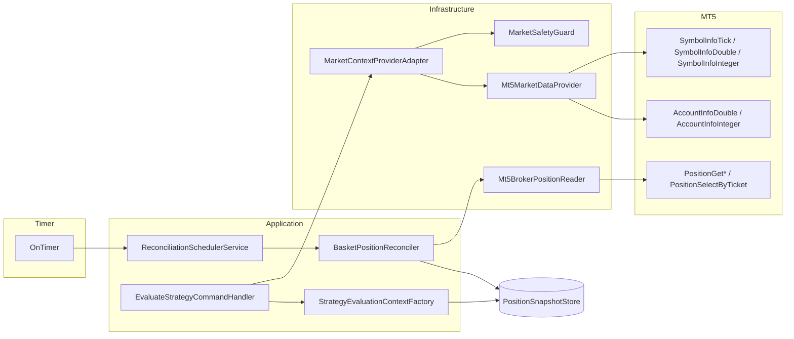

# Live Market Context and Position Snapshot Reconciliation

Sprint 5 introduces a read-only market and broker state layer. Domain and Application code never call MT5 APIs directly; Infrastructure adapters own all terminal reads.

## Read-Only Data Flow



1. **Evaluation** — `EvaluateStrategyCommandHandler` asks `IMarketContextProvider.TryBuildForBasket`. The adapter loads quote + account snapshots, runs `MarketSafetyGuard`, and builds `MarketContext` + `RiskRuntimeContext`.
2. **Context assembly** — `StrategyEvaluationContextFactory.TryBuild` merges basket profile, profit-level progress, reconciled position entries, market context, and risk placeholders.
3. **Reconciliation** — `BasketPositionReconciler` reads broker positions via `IBrokerPositionReader`, compares with local snapshots, audits mismatches, and may suspend affected baskets.

## Ownership and Freshness Model

| Artifact | Owner | Freshness |
|----------|-------|-----------|
| `CMarketQuote` | Built per read in `Mt5MarketDataProvider` | `FreshnessAgeMs` from tick time vs clock |
| `CPositionSnapshot` entries | `InMemorySnapshotStore` | Updated only via `ReplaceEntries` after clean reconcile |
| Account snapshot | Read on each evaluation attempt | Not cached across cycles in adapter |

Quotes older than `quoteStaleThresholdMs` (default 5000 ms) fail safety validation. Spread above `maxSpreadPoints` (default 500 points) fails validation.

## Reconciliation Matching Rules

Matching order for each basket:

1. **Ticket** — primary key between local `CPositionSnapshotEntry` and broker row.
2. **Comment / correlation** — `BR:{basketId}:…` or `BRE|{basketId}|{role}|step=N` parsed by `BrokerCommentParser`.
3. **Magic** — stored on each entry for audit; future baskets use profile execution magic.

Issue detection:

| Issue | Condition | Action |
|-------|-----------|--------|
| **Missing** | Local OPEN entry, ticket absent on broker | Audit + suspend basket |
| **Orphan** | Broker entry for basket, ticket absent locally | Audit + suspend basket |
| **Mismatch** | Same ticket, SL/TP/volume differ | Audit + suspend basket |
| **Clean match** | All tickets align within tolerance | `ReplaceEntries` with broker truth |

## Orphan Handling Policy

- **Never** auto-close broker positions.
- **Never** mutate broker state (no `OrderSend`, `OrderModify`, `PositionClose`).
- Orphans and mismatches create audit log entries (`RECONCILIATION` channel).
- Only the **affected basket** transitions to `SUSPENDED`.
- Other baskets continue normal scheduling.

## Scheduler Diagram

Timer cycle order (each `OnTimer` tick):

```
1. REST ingestion (if due)
2. CommandProcessor.RunCycle
3. PersistenceManager.FlushIfDue
4. ReconciliationSchedulerService.RunIfDue
```

## Safety Matrix

| Guard | Error Code | Evaluation Behavior |
|-------|------------|---------------------|
| Quote stale | `9401` | Deferred (`EmptyOk`, no commands) |
| Spread too wide | `9402` | Deferred |
| Market closed | `9403` | Deferred |
| Symbol unavailable | `9404` | Deferred |
| Account trade disabled | `9405` | Deferred |
| Reconciliation mismatch | `9406` | Suspend affected basket only |

Warnings are deduplicated per `(symbol, error)` or `account:{code}` within `warningDedupeWindowMs` (default 30 s) to avoid queue/log spam.

## Ports Summary

- `IMarketDataProvider` — quote, market snapshot, account snapshot, refresh
- `IMarketContextProvider` — strategy-safe market + risk build for a basket
- `IBrokerPositionReader` — read-only open positions as `CPositionSnapshotEntry`
- `IPositionSnapshotStore.ReplaceEntries` — aggregate-safe local snapshot update

## Test Coverage

`TestLiveMarketContext.mq5` exercises fresh/stale/spread/closed/unavailable/disabled guards, reconciliation scenarios, context factory wiring, and timer ordering/interval gates using in-memory mocks only.
