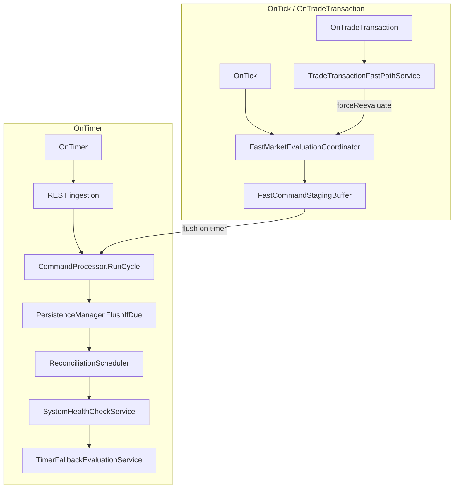

# Live Market Context and Position Snapshot Reconciliation

Sprint 5 introduces a read-only market and broker state layer. Sprint 5.1 adds an event-driven fast path for sub-second strategy evaluation on tick. Domain and Application code never call execution APIs; Infrastructure adapters own read-only MT5 access.

## Fast Path vs Slow Path



| Event | Role | Primary work |
|-------|------|--------------|
| **OnTick** | Fast market decision trigger | Quote read once, symbol-indexed basket eval, StrategyEngine, in-memory command staging |
| **OnTradeTransaction** | Execution-state refresh | Normalize tx, update snapshot, set `forceReevaluate`, update `lastTransactionUtc` |
| **OnTimer** | Slow-path maintenance | REST, command processing, persistence flush, reconciliation, health checks, tick-silence fallback only |

## OnTick Flow

1. Read bid/ask once via `CTickQuoteReader` for `_Symbol`.
2. `CSymbolBasketIndex` returns only ACTIVE baskets for that symbol (bounded by `maxBasketsPerTick`).
3. `CFastEvaluationTriggerPolicy` decides evaluation: `forceReevaluate`, profit-level cross, recovery zone cross, material quote change, max evaluation age, or quote sequence change.
4. `CBasketSnapshotLiveRefresh` updates known tickets via `PositionSelectByTicket` only (no full account scan).
5. `StrategyEvaluationContextFactory.TryBuild` + `StrategyEngine.EvaluateAll`.
6. Commands mapped with idempotency dedupe into `CFastCommandStagingBuffer` (no disk write).
7. `CBasketFastState` updated in memory; diagnostics recorded in `CInMemoryHotPathDiagnostics`.

## OnTradeTransaction Flow

1. Normalize via `CMt5TradeTransactionNormalizer`.
2. `CTradeTransactionFastPathService.Handle` applies snapshot update.
3. Set `forceReevaluate=true` and `lastTransactionUtc` on `CBasketFastState`.
4. Mark symbol index dirty.
5. **No** StrategyEngine, file I/O, REST, or reconciliation on this path.

## OnTimer Slow-Path Flow

```
1. REST ingestion (if due)
2. Flush FastCommandStagingBuffer → persistent command queue
3. CommandProcessor.RunCycle
4. PersistenceManager.FlushIfDue
5. ReconciliationSchedulerService.RunIfDue
6. SystemHealthCheckService.RunIfDue
7. TimerFallbackEvaluationService.RunIfDue (only if tick silence exceeded)
```

Strategy evaluation is **not** the primary timer trigger. Fallback runs only when no tick arrived for `tickSilenceFallbackMs`, basket is ACTIVE, and market/session validation passes.

## Event Ownership Table

| Component | Owner | Updated on |
|-----------|-------|------------|
| `CBasketFastState` | `CBasketFastStateRegistry` | OnTick eval, OnTradeTransaction |
| `CSymbolBasketIndex` | Application kernel | Bootstrap, index dirty after tx |
| Position snapshots | `IPositionSnapshotStore` | OnTradeTransaction, ticket refresh on tick, reconciliation on timer |
| Command queue (persistent) | Timer flush from staging | OnTimer only |
| Reconciliation state | `BasketPositionReconciler` | OnTimer only |

## Latency Budget

| Stage | Target | Notes |
|-------|--------|-------|
| Tick quote read | < 1 ms | Single `SymbolInfoTick` per OnTick |
| Per-basket eval decision | < 2 ms | Index lookup + trigger policy |
| StrategyEngine eval | variable | Max one eval per basket per tick |
| Total hot path | < 10 ms typical | Measured in `CInMemoryHotPathDiagnostics` only |

Configurable guards: `maxBasketsPerTick`, `minEvaluationIntervalMs`, `materialQuoteChangePoints`, `maxEvaluationAgeMs`.

## Hot-Path Forbidden Operations

OnTick must **not** perform:

- REST polling
- Disk writes / persistence flush
- JSON parsing or serialization
- Full broker/account position scan
- Full reconciliation
- File logging (in-memory diagnostics only)
- Unbounded loops over all baskets
- Processing baskets for unrelated symbols

## Fallback Timer Evaluation Rules

`CTimerFallbackEvaluationService` enqueues evaluation only when:

1. `GetTickCount64() - lastTickMsc >= tickSilenceFallbackMs`
2. Basket lifecycle is `ACTIVE` with bound strategy profile
3. `MarketContextProviderAdapter` safety validation passes

Fallback uses the same staging buffer; timer flushes to persistent queue afterward.

## Read-Only Market Data (Sprint 5)

Infrastructure adapters (`Mt5MarketDataProvider`, `Mt5BrokerPositionReader`, `TickQuoteReader`) use read-only MT5 APIs only. No `OrderSend`, `OrderModify`, or `PositionClose`.

## Reconciliation Matching Rules

Matching order for each basket:

1. **Ticket** — primary key between local `CPositionSnapshotEntry` and broker row.
2. **Comment / correlation** — `BR:{basketId}:…` or `BRE|{basketId}|{role}|step=N`.
3. **Magic** — stored on each entry for audit.

| Issue | Condition | Action |
|-------|-----------|--------|
| **Missing** | Local OPEN entry, ticket absent on broker | Audit + suspend basket |
| **Orphan** | Broker entry for basket, ticket absent locally | Audit + suspend basket |
| **Mismatch** | Same ticket, SL/TP/volume differ | Audit + suspend basket |
| **Clean match** | All tickets align | `ReplaceEntries` with broker truth |

Orphan policy: never auto-close broker positions; never mutate broker state.

## Safety Matrix

| Guard | Error Code | Fast-path behavior |
|-------|------------|-------------------|
| Quote stale | `9401` | Deferred, deduped in-memory audit |
| Spread too wide | `9402` | Deferred |
| Market closed | `9403` | Deferred |
| Symbol unavailable | `9404` | Deferred |
| Account trade disabled | `9405` | Deferred |
| Reconciliation mismatch | `9406` | Suspend affected basket on timer only |

Fast-path deferral does **not** suspend baskets unless reconciliation confirms mismatch on the slow path.

## Test Coverage

- `TestLiveMarketContext.mq5` — market guards, reconciliation, slow-path timer ordering
- `TestFastMarketPath.mq5` — tick triggers, quote sequence dedupe, symbol index, forceReevaluate, staging buffer, fallback silence gate
