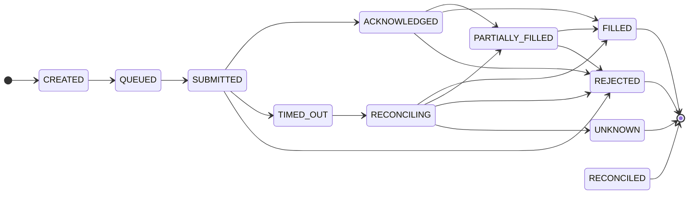

# Sprint 6C — Async Execution Correlation and Trade Transaction State Machine

**Baseline:** commit `7a65dfb4848b29f467e2775be95e3ae01c6eec39`, tag `v0.6.1-mt5-dry-run`
**Scope:** Prepare async execution lifecycle for future `OnTradeTransaction` / `OrderSendAsync` integration. **No live order submission** in this sprint.

## Goals

- Correlate broker trade transactions to pending execution requests safely.
- Enforce an explicit pending-execution state machine with terminal immutability.
- Handle timeout → reconciliation (never blind retry).
- Keep `OnTradeTransaction` hot path lightweight: no strategy, disk, `OrderCheck`, or trade APIs.

## Correlation Model

| Type | Purpose |
|------|---------|
| `CExecutionCorrelationId` | Stable token carried in comments / request metadata |
| `CBrokerRequestCorrelation` | Broker-side placeholders: order id, deal id, position ticket, magic, symbol, comment token, fingerprint |
| `CTradeTransactionCorrelationContext` | Normalized view used for matching (includes transaction key for idempotency) |
| `CPendingExecutionRegistry` | In-memory index of pending executions + processed transaction keys |
| `CPendingExecutionEntry` | Full pending record: request id, idempotency key, basket/version/hash, intent, symbol, volumes, timestamps, retry count, status, correlation state |

### Correlation priority matrix

| Priority | Strategy | Match condition |
|----------|----------|-----------------|
| 1 | `broker_order_id` | Context order id equals stored broker order id (or first order event while `SUBMITTED`) |
| 2 | `broker_deal_id` | Context deal id equals stored deal id (or first deal while submitted+) |
| 3 | `position_ticket` | Context position id equals stored ticket (or symbol match fallback while submitted+) |
| 4 | `magic_symbol_comment` | Magic + symbol + comment/correlation token |
| 5 | `request_fingerprint` | Last-resort fingerprint (request id, symbol, intent, volume) |

**Never** correlate on price alone. Price-only candidate matches are rejected as unrelated.

## Pending Execution State Machine



### Transition rules (summary)

| Rule | Behavior |
|------|----------|
| Terminal immutability | `FILLED`, `REJECTED`, `RECONCILED`, `CANCELLED`, `FAILED` cannot regress |
| Rank monotonicity | Lower-ranked states cannot be restored after forward progress |
| Duplicate transactions | Same `transactionKey` idempotently ignored |
| Out-of-order | Recorded as rejected transition; state unchanged |
| Partial fills | `filledVolume` accumulates; status toggles `PARTIALLY_FILLED` / `FILLED` |
| Timeout | `TIMED_OUT` → `RECONCILING`; **no resend** |
| Late event after timeout | Only while `RECONCILING`; resolves via reconciliation applicator |
| Blind resend block | `UNKNOWN`, `TIMED_OUT`, `RECONCILING` block resubmission |

Implementation: `CPendingExecutionTransitionRules`, `CPendingExecutionTransactionApplicator`.

## OnTradeTransaction Flow

```text
OnTradeTransaction (EA)
  → CMt5TradeTransactionNormalizer.Normalize
  → CApplicationContext.ApplyNormalizedTransaction
      → CMt5TradeTransactionAdapter.BuildContext
      → CTradeTransactionRouter.Route
          → correlate via CPendingExecutionRegistry
          → apply legal transition
          → emit lightweight CPendingExecutionEvent
          → mark basket forceReevaluate (in-memory fast state)
      → CTradeTransactionFastPathService.Handle (in-memory snapshot only)
  → return
```

### Hot-path constraints

The router/adapter path **must not**:

- Call `OrderSend`, `OrderSendAsync`, `OrderCheck`, `CTrade`, `PositionClose`, `PositionModify`
- Evaluate strategy or dispatch commands
- Write persistence / disk

Allowed: in-memory registry, bounded diagnostics (default off), in-memory snapshot + force-reevaluate flag.

## Timeout and Reconciliation

```text
Application timer
  → CExecutionTimeoutMonitor.ScanDueTimeouts
      → TIMED_OUT then RECONCILING
      → enqueue CExecutionReconciliationRequest
  → CExecutionReconciliationScheduler.ProcessBatch
      → CExecutionReconciliationResolver (read-only IBrokerPositionReader)
      → resolve to FILLED | PARTIALLY_FILLED | REJECTED | UNKNOWN
```

| Outcome | Next action |
|---------|-------------|
| FILLED / PARTIALLY_FILLED / REJECTED | Terminal resolution from `RECONCILING` |
| UNKNOWN | Remains safety-blocked; operator action required later |

## Late-event policy

1. Timeout moves entry to `RECONCILING` before broker events are applied.
2. Late fills/deletes correlate only in `RECONCILING`.
3. Applicator returns `BRE_TRADE_TX_RESULT_RECONCILED` and sets resolved terminal status.

## Duplicate / out-of-order policy

- **Duplicate:** identical `transactionKey` → `BRE_TRADE_TX_RESULT_DUPLICATE`, no state change.
- **Out-of-order:** transition that would reduce rank or leave terminal state → `BRE_TRADE_TX_RESULT_OUT_OF_ORDER`, state unchanged.

## Diagnostics (default off)

`CPendingExecutionDiagnostics` — bounded lines per session:

- transaction normalized
- correlation strategy used
- transition accepted/rejected
- duplicate / out-of-order
- timeout detected
- reconciliation requested
- unresolved unknown

Controlled by `EnableExecutionDiagnostics` input (same gate as Sprint 6B dry-run diagnostics).

## Test injection

`CPendingExecutionTestInjectionService` registers pending entries and injects normalized transactions without MT5 callbacks. Covered by `TestPendingExecutionCorrelation.mq5`.

## Prerequisites before OrderSendAsync

1. Wire submission path to populate `CPendingExecutionRegistry` (`CREATED` → `QUEUED` → `SUBMITTED`).
2. Stamp `CBrokerRequestCorrelation` at submit time (magic, comment token, fingerprint).
3. Confirm timeout/reconciliation policies against live broker latency profile.
4. Extend reconciliation reader for pending orders (not only open positions) if needed.
5. Keep blind-resend guards (`UNKNOWN` / `RECONCILING`) in submit gate.
6. Re-run chart validation with async submit + transaction correlation enabled.

## Key files

| Area | Files |
|------|-------|
| Domain | `ExecutionCorrelationId.mqh`, `BrokerRequestCorrelation.mqh`, `PendingExecutionEntry.mqh`, `PendingExecutionTransitionRules.mqh`, `TradeTransactionCorrelationContext.mqh` |
| Application | `PendingExecutionRegistry.mqh`, `TradeTransactionRouter.mqh`, `ExecutionTimeoutMonitor.mqh`, `ExecutionReconciliationScheduler.mqh` |
| Infrastructure | `Mt5TradeTransactionAdapter.mqh` |
| Tests | `TestPendingExecutionCorrelation.mq5` |
| Wiring | `ApplicationContext.mqh`, `Bootstrapper.mqh` |
