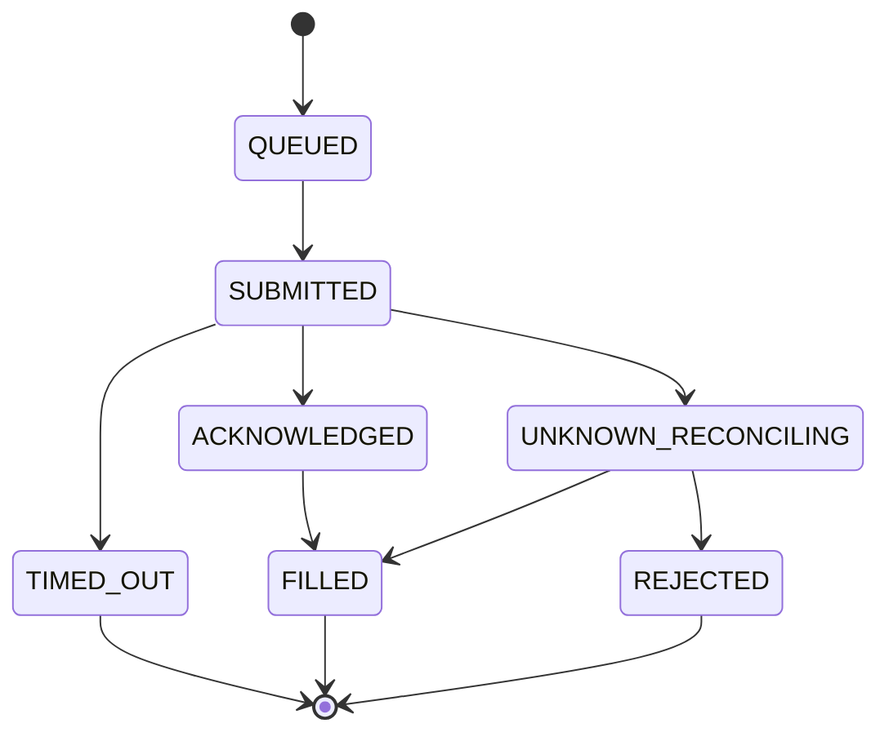

# Pending Execution Terminalization and Restart Reconciliation

Sprint 7E closes the consistency gap where broker-confirmed fills advanced the recovery step tracker while `pending_executions.dat` still recorded `SUBMITTED`.

Automatic recovery execution remains **disabled**. No new broker mutation APIs or `OrderSendAsync` callers were added.

## State Classification

| Status              | Terminal | Blocks recovery | Auto-submit allowed |
| ------------------- | -------: | --------------: | ------------------: |
| FILLED              |      yes |              no |                  no |
| REJECTED            |      yes |              no |                  no |
| CANCELLED           |      yes |              no |                  no |
| FAILED              |      yes |              no |                  no |
| TIMED_OUT           |      yes |              no |                  no |
| RECONCILED          |      yes |              no |                  no |
| UNKNOWN_RECONCILING |       no |             yes |                  no |

In-flight submission states (`QUEUED`, `SUBMITTED`, `ACKNOWLEDGED`, `PARTIALLY_FILLED`, etc.) also block recovery until they terminalize or become `UNKNOWN_RECONCILING`.

Persisted enum: `BRE_TRADE_EXEC_STATUS_RECONCILING` — label `UNKNOWN_RECONCILING`.

## Lifecycle

```text
QUEUED → SUBMITTED → ACKNOWLEDGED → FILLED | REJECTED | CANCELLED
SUBMITTED → TIMED_OUT            (terminal audit: confirmed no-fill after deadline)
SUBMITTED → UNKNOWN_RECONCILING  (broker outcome indeterminate after deadline)
UNKNOWN_RECONCILING → FILLED | REJECTED | CANCELLED | RECONCILED  (read-only reconcile)
```



## Query Semantics

Authoritative helpers: `CPendingExecutionQuery` and `CPendingExecutionLifecycleService`.

| API | Behavior |
|-----|----------|
| `IsTerminalStatus` | `FILLED`, `REJECTED`, `CANCELLED`, `FAILED`, `TIMED_OUT`, `RECONCILED` |
| `IsUnknownReconcilingStatus` | `RECONCILING` only |
| `IsUnresolvedStatus` | not terminal and not `NONE` |
| `HasUnresolvedPendingExecution` | any `IsUnresolvedStatus` entry for basket |
| `GetTerminalExecutionHistory` | terminal audit records including `TIMED_OUT` |

`TradeExecutionStatusIsTerminal` aligns with `IsTerminalStatus` (includes `TIMED_OUT`).

Do **not** use generic registry existence checks for pending status.

## Timeout Behavior

On deadline (`CExecutionTimeoutMonitor::ScanDueTimeouts`):

1. Read-only broker position query via `CExecutionReconciliationResolver`
2. **FILLED** → `MarkFilled` (terminal, idempotent)
3. **REJECTED** (no matching position) → `MarkTimedOut` (terminal audit, does not block recovery)
4. **UNKNOWN** (indeterminate read) → `MarkUnknownReconciling` + enqueue read-only reconciliation + diagnostics

No automatic order retry or resubmission occurs on timeout.

## UNKNOWN_RECONCILING Behavior

- Only state that blocks recovery when broker outcome is genuinely unresolved
- Persisted as `RECONCILING` with label `UNKNOWN_RECONCILING`
- Startup: `CPendingExecutionStartupReconciliationService` reloads and read-only reconciles
- Periodic: `CExecutionReconciliationScheduler` processes queued entries (read-only position resolver)
- Resolves to terminal `FILLED`, `REJECTED`, `CANCELLED`, or `RECONCILED` without broker mutation
- `BlocksBlindResend` applies only to `UNKNOWN_RECONCILING`

## Transaction-to-Terminalization Flow

```text
broker transaction correlation
  → pending execution terminalization (registry)
  → durable persistence (SaveEntryState)
  → recovery step tracker update (FILLED only)
  → generic terminal event / audit
```

Recovery step advances exactly once on broker-confirmed `FILLED` only.

## Idempotency

- Duplicate transaction keys return `DUPLICATE` before transition
- Terminal transitions no-op when already terminal
- Terminal events emit once per first terminal transition
- `TryMarkFilled` advances recovery step at most once

## Automatic Recovery

Automatic recovery execution is **not enabled**. Startup and periodic reconciliation are read-only with respect to broker submission.

## Key Files

| Layer | File |
|-------|------|
| Domain | `PendingExecutionQuery.mqh`, `PendingExecutionTransitionRules.mqh` |
| Application | `PendingExecutionLifecycleService.mqh`, `ExecutionTimeoutMonitor.mqh`, `PendingExecutionStartupReconciliationService.mqh` |
| Tests | `TestPendingExecutionTerminalization.mq5` |
