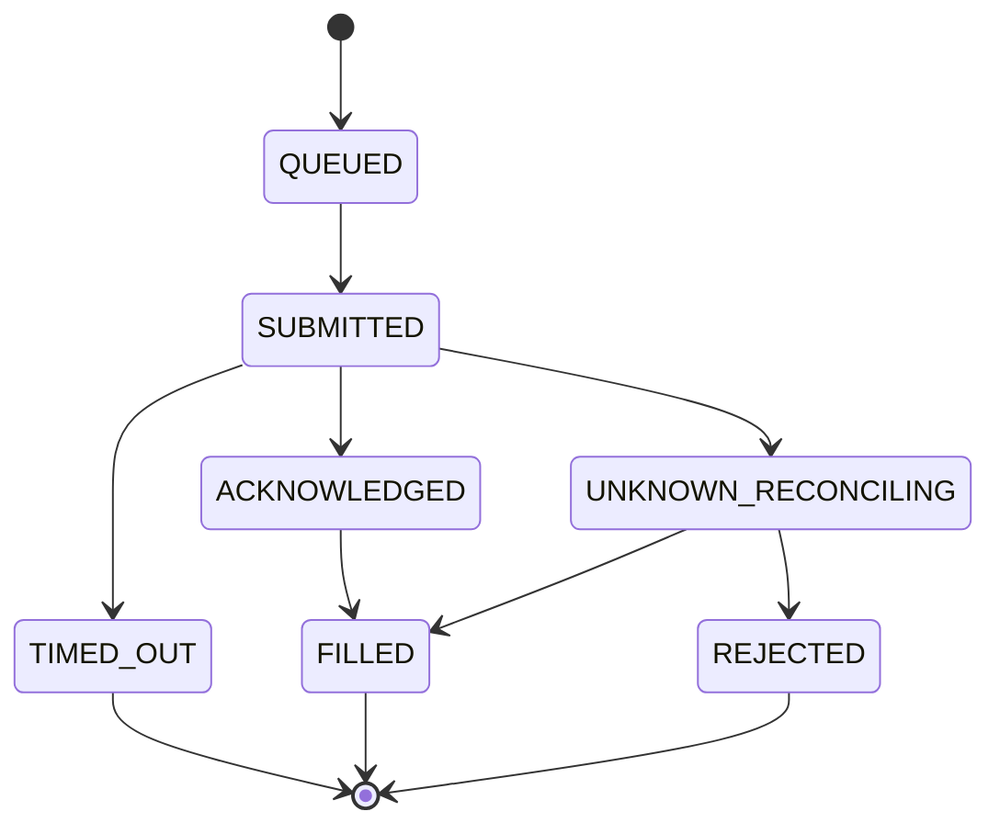

# Pending Execution Terminalization and Restart Reconciliation

Sprint 7E closes the consistency gap where broker-confirmed fills advanced the recovery step tracker while `pending_executions.dat` still recorded `SUBMITTED`.

Automatic recovery execution remains **disabled**. No new broker mutation APIs or `OrderSendAsync` callers were added.

## State Classification

| Status              | Terminal | Blocks recovery | Auto-submit allowed |
| ------------------- | -------: | --------------: | ------------------: |
| FILLED              |      yes |              no |                  no |
| REJECTED            |      yes |              no |                  no |
| CANCELLED           |      yes |              no |                  no |
| FAILED              |      yes |              no |                  no |
| TIMED_OUT           |      yes |              no |                  no |
| RECONCILED          |      yes |              no |                  no |
| UNKNOWN_RECONCILING |       no |             yes |                  no |

In-flight submission states (`QUEUED`, `SUBMITTED`, `ACKNOWLEDGED`, `PARTIALLY_FILLED`, etc.) also block recovery until they terminalize or become `UNKNOWN_RECONCILING`.

Persisted enum: `BRE_TRADE_EXEC_STATUS_RECONCILING` — label `UNKNOWN_RECONCILING`.

## Lifecycle

```text
QUEUED → SUBMITTED → ACKNOWLEDGED → FILLED | REJECTED | CANCELLED
SUBMITTED → TIMED_OUT            (terminal audit: confirmed no-fill after deadline)
SUBMITTED → UNKNOWN_RECONCILING  (broker outcome indeterminate after deadline)
UNKNOWN_RECONCILING → FILLED | REJECTED | CANCELLED | RECONCILED  (read-only reconcile)
```



## Query Semantics

Authoritative helpers: `CPendingExecutionQuery` and `CPendingExecutionLifecycleService`.

| API | Behavior |
|-----|----------|
| `IsTerminalStatus` | `FILLED`, `REJECTED`, `CANCELLED`, `FAILED`, `TIMED_OUT`, `RECONCILED` |
| `IsUnknownReconcilingStatus` | `RECONCILING` only |
| `IsUnresolvedStatus` | not terminal and not `NONE` |
| `HasUnresolvedPendingExecution` | any `IsUnresolvedStatus` entry for basket |
| `GetTerminalExecutionHistory` | terminal audit records including `TIMED_OUT` |

`TradeExecutionStatusIsTerminal` aligns with `IsTerminalStatus` (includes `TIMED_OUT`).

Do **not** use generic registry existence checks for pending status.

## Timeout Behavior

On deadline (`CExecutionTimeoutMonitor::ScanDueTimeouts`):

1. Read-only broker position query and bounded history correlation via `CExecutionReconciliationResolver`
2. **FILLED** (open position or historical deal evidence) → `MarkFilled` (terminal, idempotent)
3. **REJECTED** (explicit broker reject evidence only) → `MarkRejected`
4. **TIMED_OUT** (history available, no execution after reconciliation evidence window elapsed) → `MarkTimedOut` (terminal audit, does not block recovery)
5. **UNKNOWN_RECONCILING** (indeterminate read or history unavailable) → `MarkUnknownReconciling` + enqueue read-only reconciliation + diagnostics

Missing open positions or orders alone **never** produce `REJECTED`. Current-state absence is not rejection evidence.

No automatic order retry or resubmission occurs on timeout.

## History-Aware Reconciliation

`CExecutionReconciliationResolver` uses a two-stage read-only decision hierarchy:

| Stage | Source | Scope | Survives manual close | Proves fill | Proves reject |
|---|---|---|---|---|---|
| Current open state | `IBrokerPositionReader` | Open BRE-tagged positions only | no | partial (in-flight volume) | no |
| Open pending orders | `IBrokerExecutionHistoryReader` | Current `OrdersTotal()` by broker order id | n/a | no (in-flight) | no |
| Broker history | `IBrokerExecutionHistoryReader` | Bounded window around submitted/created time; deal id, order id, comment/token | yes | yes (deal volume) | yes (explicit canceled/reject order with zero fill) |
| Transaction cache | `TradeTransactionRouter` / persisted entry | Live `OnTradeTransaction` path | yes | yes | yes |
| Persisted correlation | `CPendingExecutionEntry` | order id, deal id, ticket, token, comment | yes | indirect | indirect |

### Authoritative outcomes

| Evidence | Allowed outcome |
|---|---|
| Correlated broker deal/history confirms fill | `FILLED` |
| Correlated broker rejection / definitive reject result | `REJECTED` |
| Correlated cancellation evidence | `CANCELLED` |
| Explicit terminal failure evidence | `FAILED` |
| No open position/order and insufficient history | `UNKNOWN_RECONCILING` |
| History available, no execution after reconciliation evidence window elapsed | `TIMED_OUT` |
| Current pending order/position exists | retain in-flight (`UNKNOWN`) |

### Manual-close-after-fill scenario

```text
submission → FILLED → position later manually closed → restart/reconcile
```

Expected:

- reconciliation resolves or remains `FILLED` when historical deal evidence matches;
- recovery/profit-level progression is not reversed;
- record is terminal historical audit;
- it does not block future evaluation;
- it is never reclassified as `REJECTED` from missing open state alone.

### Stale persisted SUBMITTED repair

Real demo records may persist `SUBMITTED` with `filledVolume=0` even after a broker-confirmed fill because broker order/deal ids are not yet written to disk. Startup reconciliation therefore:

1. Hydrates envelope metadata (magic, submitted anchor from `PreparedAtUtc`) before read-only resolve.
2. Anchors history lookup to `SubmittedAtUtc` / `PreparedAtUtc` / `DeadlineUtc`, not only `TimeCurrent()`.
3. Matches historical deals by persisted stamp (`BRE|token|...`), parent order comment when deal comment is empty, symbol, and magic within the bounded window.
4. Falls back to a unique bounded fingerprint (`correlation token + symbol + magic + normalized volume + intent entry type + tight time window`) only when stamp paths fail and exactly one candidate exists.
5. Never downgrades known fill evidence to `TIMED_OUT` or `REJECTED`.
6. Repairs stale `SUBMITTED` → `FILLED` when historical fill or persisted fill volume evidence exists.
7. Classifies `TIMED_OUT` only after the configured reconciliation evidence window elapses, not merely the submission deadline.

`FILLED` is monotonic: it must never transition to `TIMED_OUT`, `REJECTED`, `CANCELLED`, `FAILED`, `UNKNOWN_RECONCILING`, or `RECONCILED`.

## UNKNOWN_RECONCILING Behavior

- Only state that blocks recovery when broker outcome is genuinely unresolved
- Persisted as `RECONCILING` with label `UNKNOWN_RECONCILING`
- Startup: `CPendingExecutionStartupReconciliationService` reloads and read-only reconciles
- Periodic: `CExecutionReconciliationScheduler` processes queued entries (read-only position + history resolver)
- Resolves to terminal `FILLED`, `REJECTED`, `CANCELLED`, or `RECONCILED` without broker mutation
- `BlocksBlindResend` applies only to `UNKNOWN_RECONCILING`

## Transaction-to-Terminalization Flow

```text
broker transaction correlation
  → pending execution terminalization (registry)
  → durable persistence (SaveEntryState)
  → recovery step tracker update (FILLED only)
  → generic terminal event / audit
```

Recovery step advances exactly once on broker-confirmed `FILLED` only.

## Idempotency

- Duplicate transaction keys return `DUPLICATE` before transition
- Terminal transitions no-op when already terminal
- Terminal events emit once per first terminal transition
- `TryMarkFilled` advances recovery step at most once

## Automatic Recovery

Automatic recovery execution is **not enabled**. Startup and periodic reconciliation are read-only with respect to broker submission.

## Key Files

| Layer | File |
|-------|------|
| Domain | `PendingExecutionQuery.mqh`, `PendingExecutionTransitionRules.mqh` |
| Application | `PendingExecutionLifecycleService.mqh`, `ExecutionTimeoutMonitor.mqh`, `PendingExecutionStartupReconciliationService.mqh`, `ExecutionReconciliationResolver.mqh` |
| Infrastructure | `Mt5BrokerExecutionHistoryReader.mqh`, `InMemoryBrokerExecutionHistoryReader.mqh` |
| Tests | `TestPendingExecutionTerminalization.mq5` |
