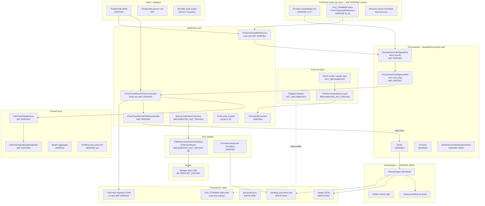
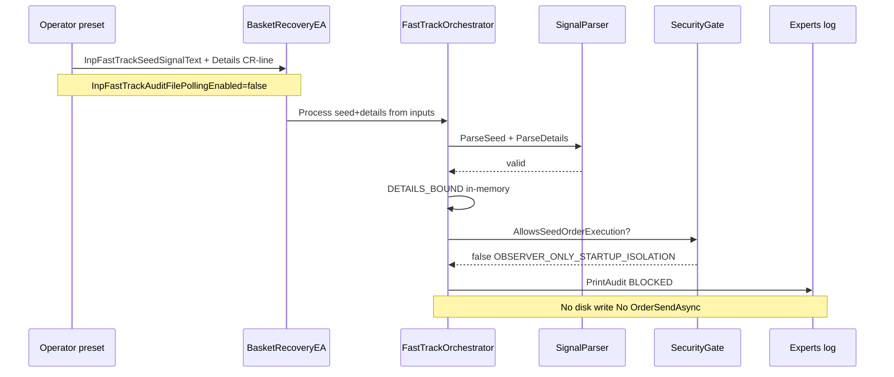
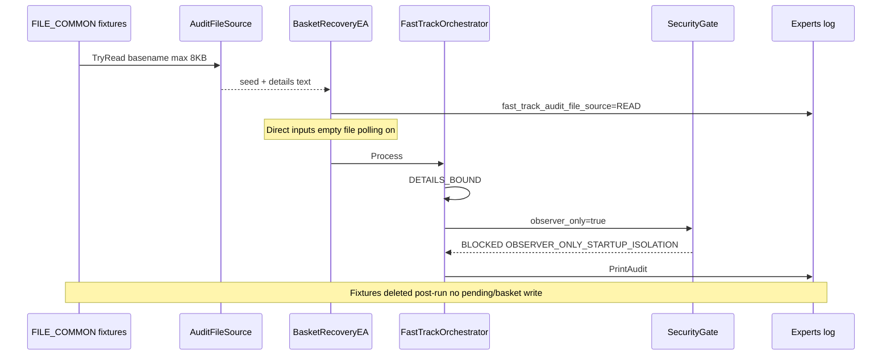
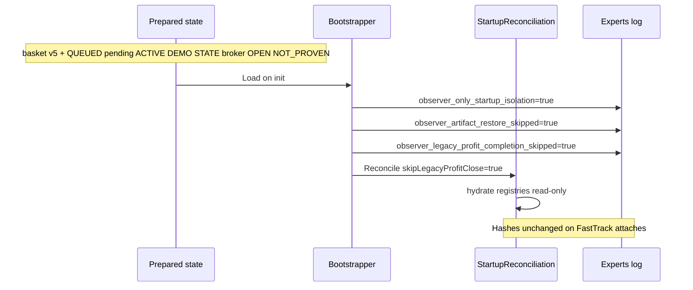
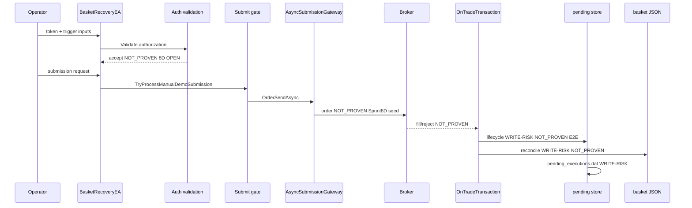
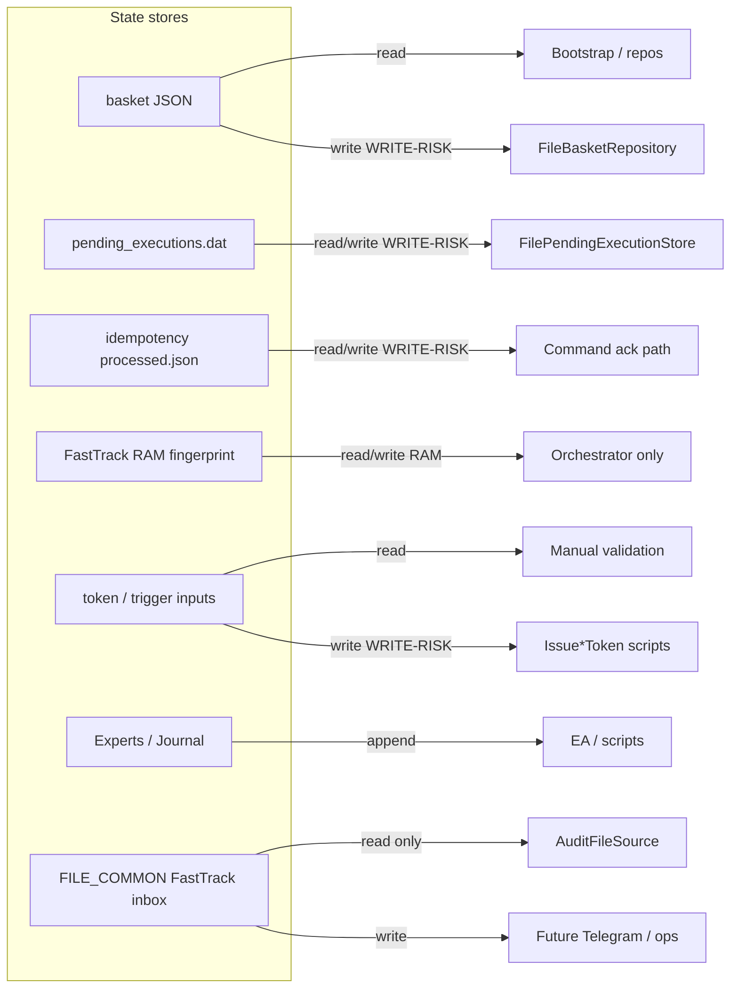

# Basket Recovery EA — Living Architecture Map (Current)

**Generated:** 2026-07-05 (Sprint 9A FastTrack audit-only consolidation)
**Role:** Software Architect + MQL5 Tech Lead + QA Lead
**Scope:** Repo source, worktree delta, retained validation evidence (no re-run in consolidation pass).

---

## Baseline snapshot

| Item | Value |
|------|-------|
| **Committed HEAD** | `2275fec` — *feat(ea): isolate observer-only startup paths* |
| **HEAD = origin/main** | Yes |
| **Worktree** | **DIRTY** — 4 modified + untracked FastTrack WIP, Sprint 8C tests, ops docs |
| **HEAD vs worktree (EA)** | HEAD: observer-only isolation only; worktree: + FastTrack + file inbox |
| **Demo terminal (evidence)** | D0E `25676579`, VantageMarkets-Demo, XAUUSD M1 |
| **Stale doc** | `docs/PROJECT_STATE.md` → commit `51c1f123` — **historical only** |

### Status labels

| Label | Meaning |
|-------|---------|
| **VERIFIED** | Code + test and/or D0E runtime log |
| **IMPLEMENTED_NOT_PROVEN** | Code exists; broker/runtime proof incomplete |
| **WIP** | Worktree only (untracked / not on HEAD) |
| **LEGACY** | Sprint 8C regression-only |
| **NOT_IMPLEMENTED** | Absent in repo |

### Sprint 9A retained validation evidence

| Gate | Result | When |
|------|--------|------|
| TestSprint9b compile | 0 error / 0 warning | 2026-07-05 21:35 |
| TestSprint9b runtime | 46 passed / 0 failed | 2026-07-05 21:35 |
| BasketRecoveryEA compile | 0 error / 8 legacy warnings | 2026-07-05 21:37 |
| FastTrack direct-input observer attach | DETAILS_BOUND → BLOCKED → OBSERVER_ONLY | 21:27:22 |
| FastTrack FILE_COMMON observer attach | READ → DETAILS_BOUND → BLOCKED → OBSERVER_ONLY | 21:44:36 |
| Broker / token | OrderSendAsync=0, token=0 | both attaches |
| Sprint 8D state | pending + basket hash unchanged | both attaches |
| Open orders / positions | 0 / 0 | Journal sync |

---

## A. Executive Mermaid flowchart



---

## B. Sequence diagrams

### B1) FastTrack direct-input audit-only (VERIFIED @ 21:27:22)



### B2) FastTrack FILE_COMMON audit-only (VERIFIED @ 21:44:36)



### B3) Sprint 8D prepared-state observer startup (VERIFIED read-only attach)



### B4) Target broker execution flow (IMPLEMENTED_NOT_PROVEN post-submit)



---

## C. State ownership diagram



| State | Readers | Writers | Observer-only | Write-risk | Broker-risk |
|-------|---------|---------|---------------|------------|-------------|
| basket JSON | Bootstrap, repos, audit | Submission/reconcile | Read hydrate; **no change on 9A attach** | **WRITE-RISK** | Indirect on fill |
| pending_executions.dat | Startup reconcile | Submission services | Read; **hash unchanged 9A** | **WRITE-RISK** | On submit/fill |
| idempotency store | CommandProcessor | REST ack path | Un touched 9A | **WRITE-RISK** | No |
| FastTrack RAM fingerprint | Orchestrator | Orchestrator Process | N/A | **None** | **None** |
| token / trigger | Manual services | Validation scripts | Empty in observer presets | **WRITE-RISK** if issued | If used to submit |
| Experts / Journal | QA | EA PrintAudit | Audit only 9A | None | None |
| FILE_COMMON inbox | AuditFileSource | External / test fixtures | Read-only in EA | Test fixtures only | **None** |

---

## D. Safety boundary matrix

| Operation | Broker order | Disk state | Token | EA attach | Explicit approval |
|-----------|-------------|------------|-------|-----------|-------------------|
| FastTrack test script (TestSprint9b) | No | Test fixtures only (cleaned) | No | No | No |
| FastTrack direct observer attach | No | **Unchanged VERIFIED** | No | Yes | **Yes** |
| FastTrack FILE_COMMON observer attach | No | **Unchanged VERIFIED** | No | Yes | **Yes** |
| REST ingest | Possible if enabled | Idempotency WRITE-RISK | API key | Yes | Yes + external worker |
| Sprint 8D audit script | No | Read-only | No | No | No |
| Token issue scripts | No | Artifact WRITE-RISK | **Creates** | No | **Yes** |
| OPEN submit | **Yes** OrderSendAsync | Pending+basket WRITE | Uses trigger | Yes | **Yes** NOT_PROVEN 8D |
| Restart reconcile | Indirect | Pending transitions | No | On startup | Normal start |
| M1/M2/M3 partial close | **Yes** target | WRITE-RISK | Uses trigger | Yes | **Yes** NOT_PROVEN |

---

## E. File responsibility map (≤30)

| File / group | Responsibility | Sprint | Status | Broker/state | Milestone |
|--------------|----------------|--------|--------|--------------|-----------|
| `BasketRecoveryEA.mq5` | EA entry, FastTrack wiring | 9A | **WIP** modified | Attach-dependent | **Required** |
| `FastTrackAuditFileSource.mqh` | FILE_COMMON read-only inbox | 9A | **WIP** new | None | **Required** |
| `FastTrackManualTestOrchestrator.mqh` | Two-stage audit orchestration | 9A | **WIP** | RAM only | **Required** |
| `FastTrackManualTestSecurityGate.mqh` | Blocks seed execution | 9A | **WIP** | None | **Required** |
| `FastTrackManualTestTypes.mqh` | Stage/enums/inputs | 9A | **WIP** | None | **Required** |
| `FastTrackSignalDetailsFactory.mqh` | Parse → SignalDetails | 9A | **WIP** | None | **Required** |
| `FastTrackSignalParser.mqh` | Seed/details parse | 9A | **WIP** | None | **Required** |
| `FastTrackSignalParseResult.mqh` | Parse result struct | 9A | **WIP** | None | **Required** |
| `FastTrackSignalTypes.mqh` | Parse enums | 9A | **WIP** | None | **Required** |
| `FastTrackSignalTextUtils.mqh` | Line split / aliases | 9A | **WIP** | None | **Required** |
| `FastTrackSignalDetailsValidator.mqh` | SL/TP geometry | 9A | **WIP** | None | **Required** |
| `FastTrackSeedBasketMatcher.mqh` | Seed/details bind | 9A | **WIP** | None | **Required** |
| `TestSprint9bFastTrackManualTestWiring.mq5` | Wiring + file inbox tests | 9A | **WIP** VERIFIED | None | **Required** |
| `TestSprint9aFastTrackTwoStageBasketCore.mq5` | Parser unit tests | 9A | **WIP** | None | Optional |
| `FastTrackRecoveryDecisionService.mqh` | Recovery decisions | 9+ | **OUT_OF_SCOPE** | Future | **Excluded** |
| `FastTrackDeRiskBreakEvenDecisionService.mqh` | De-risk/BE | 9+ | **OUT_OF_SCOPE** | Future | **Excluded** |
| `FastTrackProjectedRiskContract.mqh` | Risk contract | 9+ | **OUT_OF_SCOPE** | Future | **Excluded** |
| `Interfaces/Bootstrapper.mqh` | Composition root | 8D | **VERIFIED HEAD** | Hydrate state | HEAD already |
| `TestSprint8c*.mq5` (12 files) | Profit-close regression | 8C | **LEGACY** untracked | None | **Excluded** |
| `Validation/Sprint8D/*` | Prepared state / submit | 8D | **LEGACY** boundary | WRITE if run | **Excluded** |
| `ARCHITECTURE_MAP_CURRENT.md` | Living architecture | 9A | **WIP** doc | None | **Optional docs** |
| `docs/operations/MT5_DEPLOYMENT_*` | D0E runbook | 8D | **WIP** ops | None | Optional |
| `docs/operations/presets/PROFILE_A_*` | Observer preset source | 8D | **WIP** | None | Optional |

---

## F. Sprint map

### Sprint 0–7E core (VERIFIED on HEAD)

Hexagonal kernel, basket/pending persistence, manual demo/recovery code paths, async gateway. Broker evidence for 6G/7D per historical docs.

### Sprint 8C legacy validation (LEGACY)

Manual profit-close candidate pipeline, ticket-scoped pending, bootstrap restore. Observer mode skips artifact restore. **Not part of 9A commit.**

### Sprint 8D broker proof (ACTIVE DEMO STATE — broker NOT_PROVEN)

Prepared basket v5 + QUEued pending on D0E. Observer attach verified. OPEN/FILLED/M1–M3 chain **NOT_PROVEN**.

### Sprint 9A FastTrack audit-only (WIP — COMMIT_READY candidate)

| | |
|-|-|
| **Goal** | Telegram-like two-stage signal → parse → in-memory audit → security block; optional FILE_COMMON inbox |
| **Done** | Full parse/orchestrate/gate chain, file source, EA wiring, TestSprint9b 46/46, dual observer runtime PASS |
| **Not proven** | Production Telegram writer; EA-level IDEMPOTENT_SKIP on timer (orchestrator idempotency tested in script) |
| **Exit criteria** | Merge WIP to HEAD; ops preset doc for CR-separated details; no broker/persistence regression |

---

## G. Do-not-infer

1. **Direct Telegram ingestion** — NOT_IMPLEMENTED
2. **Sprint 8D OPEN / FILLED** — NOT_PROVEN
3. **Restart reconcile E2E** for 8D multi-level chain — NOT_PROVEN
4. **M1/M2/M3 broker partial close** — planner VERIFIED; broker NOT_PROVEN
5. **Automated recovery / break-even / de-risk execution** — NOT_IMPLEMENTED (manual routes only)
6. **REST worker in repo** — NOT_IMPLEMENTED
7. **FastTrack on committed HEAD** — WIP until merge
8. **FastTrackRecovery/DeRisk/ProjectedRisk modules** — present but OUT_OF_SCOPE for 9A audit-only
9. **`docs/PROJECT_STATE.md`** — stale; use this map + `2275fec`

---

## Sprint 9A minimal commit candidate (reference)

### Required (14 code files)

```
mt5/Experts/BasketRecovery/BasketRecoveryEA.mq5
mt5/Include/BasketRecovery/Application/Strategy/FastTrack/FastTrackAuditFileSource.mqh
mt5/Include/BasketRecovery/Application/Strategy/FastTrack/FastTrackManualTestOrchestrator.mqh
mt5/Include/BasketRecovery/Application/Strategy/FastTrack/FastTrackManualTestSecurityGate.mqh
mt5/Include/BasketRecovery/Application/Strategy/FastTrack/FastTrackManualTestTypes.mqh
mt5/Include/BasketRecovery/Application/Strategy/FastTrack/FastTrackSignalDetailsFactory.mqh
mt5/Include/BasketRecovery/Domain/Strategy/FastTrack/FastTrackSignalParser.mqh
mt5/Include/BasketRecovery/Domain/Strategy/FastTrack/FastTrackSignalParseResult.mqh
mt5/Include/BasketRecovery/Domain/Strategy/FastTrack/FastTrackSignalTypes.mqh
mt5/Include/BasketRecovery/Domain/Strategy/FastTrack/FastTrackSignalTextUtils.mqh
mt5/Include/BasketRecovery/Domain/Strategy/FastTrack/FastTrackSignalDetailsValidator.mqh
mt5/Include/BasketRecovery/Domain/Strategy/FastTrack/FastTrackSeedBasketMatcher.mqh
mt5/Scripts/BasketRecovery/Tests/TestSprint9bFastTrackManualTestWiring.mq5
```

### Optional docs

- `docs/architecture/ARCHITECTURE_MAP_CURRENT.md` (this file)

### Explicitly excluded

- Sprint 8C test scripts, Sprint 8D validation scripts
- `FastTrackRecoveryDecisionService.mqh`, `FastTrackDeRiskBreakEvenDecisionService.mqh`, `FastTrackProjectedRiskContract.mqh`
- `docs/operations/*`, `mt5/Profiles/*` (ops convenience, not code milestone)
- Modified `README.md`, `TestLiveMarketContext.mq5`, `62-manual-demo-*.md` (unrelated dirty files)

---

*Living document — update on HEAD merge or new broker proof.*
